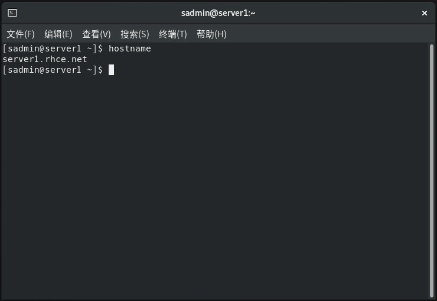
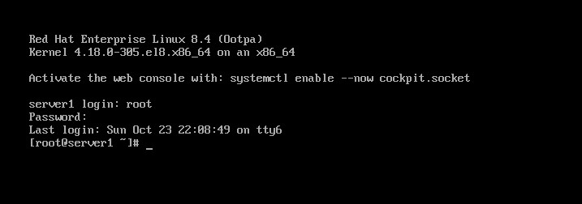
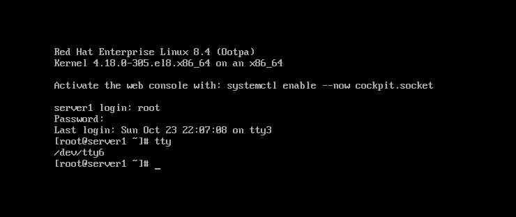
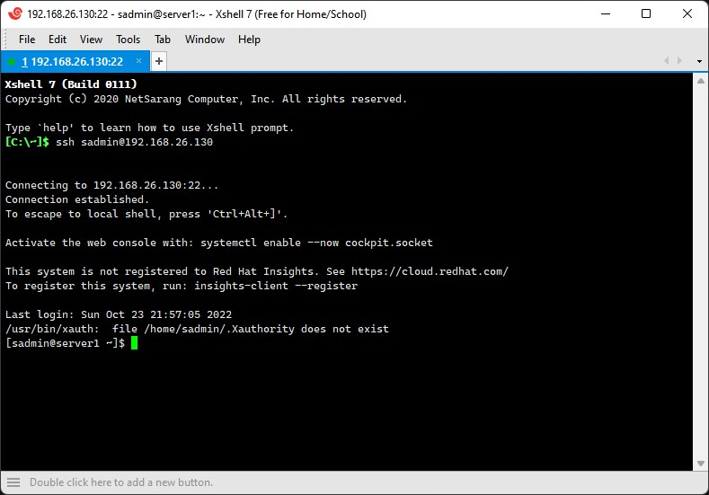
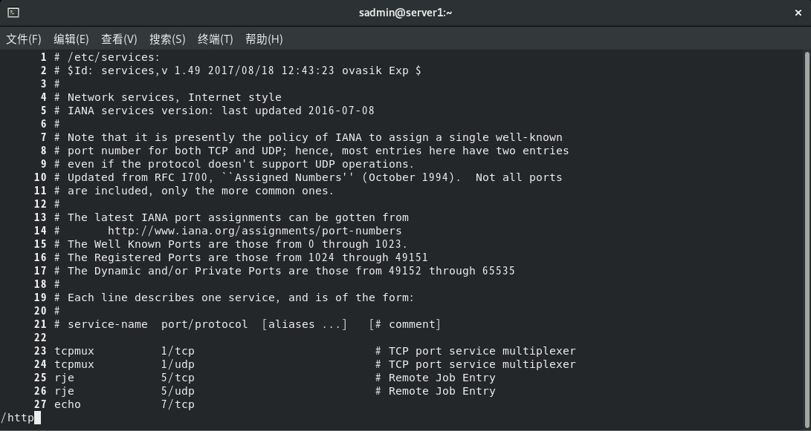
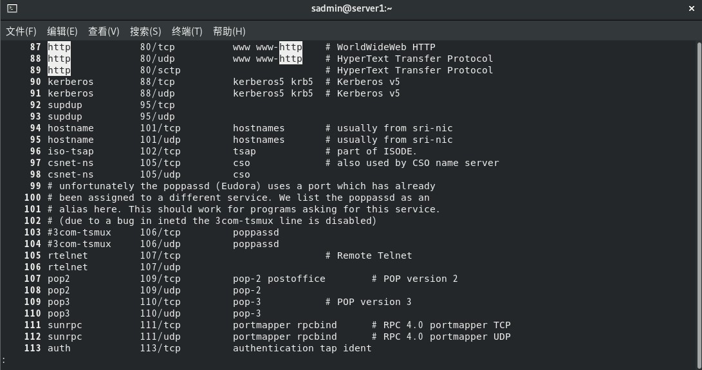

# Chapter 2 - 命令行的使用

[返回](../README.md)

[TOC]

## 1. 在哪里执行命令

Linux 的命令行由名为 shell 的程序提供。RHEL8 中默认的 shell 是 GNU Bourne-Again Shell (bash)

### 1.1 终端

终端是一个基于文本的界面，用于向计算机系统输入命令及显示输出。



### 1.2 切换到控制台

Linux 计算机的物理控制台（包括键盘和显示器）支持多个**虚拟控制台**，可以**运行单独的终端**。

每个虚拟控制台均支持独立的登录会话。可以同时按 `Ctrl+Alt+(F1~F6)` 来切换。

#### 图形化界面

* `Ctrl + Alt + F1` -- 切换到新的图形终端界面

* `Ctrl + Alt + F2` -- 切换到当前默认的图形终端界面

#### 字符界面

* `Ctrl + Alt + F3` -- 打开第三个字符终端

  

* `Ctrl + Alt + F4` -- 打开第四个字符终端

* `Ctrl + Alt + F5` -- 打开第五个字符终端

* `Ctrl + Alt + F6` -- 打开第六个字符终端

  

### 1.3 通过 ssh 远程登陆

Linux 用户和管理员通常需要通过网络连接到远程系统，来获取对远程系统的 Shell 访问权限。

在 Linux 系统中，获取远程系统上 shell 提示符的最常用方法是 **Secure Shell (SSH)**

* 使用密码登录：`ssh remoteuser@remotehost`



* 使用公钥身份验证：客户端需要拥有包含私钥的文件（相当于用户的密码），服务端需要配置账户的公钥。用户在远程登录时提供私钥，则远端服务器就会在不询问密码的情况下登录用户。

  ```sh
  ssh -i mykey.pem remoteuser@remotehost
  ```

## 2. 执行命令的语法

```bash
命令 -选项 参数
```

* 命令 -- 表达想要做的事情，比如创建用户，列出文件
* 选项 -- 调整命令的行为
* 参数 -- 用于指明运行命令的目标，比如仅查看文件前20行
* 命令合并：`命令 -a -b -c -d 可以合并成 --> 命令 -abcd`
* 选项是多个字符，用长格式 -- 比如 --help

```sh
# 例如如下命令： 锁定用户 user01 账户密码

usermod -L user01
# 命令 -- usermod
# 选项 -- -L
# 参数 -- user01
```

#### ls 命令

```sh
# ls
ls

# 显示所有文件
ls -a

# 长格式
ls -l

ls -al

ls --help

ls -l /boot/

# 以更加可读的模式列出文件
ls -lh /boot/

# -d 查看文件夹本身的大小，而不是里面文件的大小
# 相当于用购物袋装了一堆东西，这里显示的是购物袋自身的重量
ls -lhd /boot/
```

#### du 命令

```sh
# du 如果要查看购物袋和文件夹大小 -s 只显示目录，不显示文件大小
du -sh /boot/

[root@server1 sadmin]# du /boot
0	/boot/efi/EFI/redhat
0	/boot/efi/EFI
0	/boot/efi
3256	/boot/grub2/i386-pc
2504	/boot/grub2/fonts
5776	/boot/grub2
8	/boot/loader/entries
8	/boot/loader
203080	/boot
[root@server1 sadmin]# du -sh /boot/
199M	/boot/
```

## 3. bash 快捷键

* **Tab 键**
  * 实现对命令、参数、文件的内容补全
* **Ctrl + C 组合键**
  * 终止当前进程的运行
  * 或者使用 # 注释命令 `# ls`
* **Ctrl + A 组合键**
  * 光标移动到开头
  * 或者可以按 Home 键
* **Ctrl + E 组合键**
  * 光标移动到结尾
  * 或者可以按 End 键
* **Ctrl + U 组合键**
  * 从光标位置删除到开头
* **Ctrl + K 组合键**
  * 从光标位置删除到结束
* **快速引用上一个命令的最后一部分**
  * 比如前一个命令是 `ls /etc/systemd/system`，快速引用`/etc/systemd/system`
  * 先按 `esc` 键，再按 `.`
  * 或者一直按住 `alt` 再按 `.`
* **查看历史命令**
  * `history` 显示所有执行过的命令，然后敲 `!命令编号` 可以快速执行该编号对应的历史命令
* **Ctrl + R 组合键**
  * 反向搜索历史命令
    * 如果敲回车，则直接执行该命令
    * 如果敲 esc，则保留该命令，不立刻执行
* **Ctrl + L 组合键**
  * 清除屏幕
  * 或者也可以输入 clear 命令

* **Ctrl + / 组合键**
  * 撤销操作 -- 撤销最近的修改
* **Ctrl + Shift + T 组合键**
  * 快速打开新的终端标签
  * **Ctrl + PageUp** 或者 **Ctrl + PageDown** 在标签之间快速切换
  * **Ctrl + D 组合键**关闭当前标签页
* **Alt + B 组合键**
  * 光标往回跳一个词
* **Alt + F 组合键**
  * 光标往前跳一个词
* **Alt + D 组合键**
  * 删除光标位置的单词

> 其他的快捷键参考
>
> [技术|Bash 快捷键大全 (linux.cn)](https://linux.cn/article-5660-1.html)
>
> [有用的 Bash 快捷键清单 - 知乎 (zhihu.com)](https://zhuanlan.zhihu.com/p/34509032)

## 4. 文件操作的常见命令

* `file` 识别文件类型

  * Linux 中的文件类型一般与文件的后缀名没有关系，而是通过分析文件头部信息中的标识来显示文件类型。

  * 语法格式：`file [参数] 文件`

  * ```sh
    # 文本文件
    [sadmin@server1 ~]$ file /etc/hosts 
    /etc/hosts: ASCII text
    
    # -b 查看某个文件的类型，但不显示文件名
    [sadmin@server1 ~]$ file /etc/hosts -b
    ASCII text
    
    # -i 以MIME类别来显示某个文件的类型
    [sadmin@server1 ~]$ file /etc/hosts -i
    /etc/hosts: text/plain; charset=us-ascii
    
    # 二进制文件
    [sadmin@server1 ~]$ file /usr/sbin/ifconfig 
    /usr/sbin/ifconfig: ELF 64-bit LSB shared object, x86-64, version 1 (SYSV), dynamically linked, interpreter /lib64/ld-linux-x86-64.so.2, for GNU/Linux 3.2.0, BuildID[sha1]=5a7255e0eb116c7bc8bde8b4b0de325f8d0839df, stripped
    ```

* `wc` 统计文件的字节数、单词数、行数，字符包括换行符。

  * 英文缩写为 word count

  * 语法格式：`wc [参数] 文件`

  * ```sh
    [sadmin@server1 ~]$ wc /etc/hosts 
      2  10 158 /etc/hosts
    
    # -l, --lines 仅统计行数
    [sadmin@server1 ~]$ wc -l /etc/hosts 
    2 /etc/hosts
    
    # -w, --words 统计单词数
    [sadmin@server1 ~]$ wc -w /etc/hosts 
    10 /etc/hosts
    
    # -c, --bytes 统计字节数
    [sadmin@server1 ~]$ wc -c /etc/hosts 
    158 /etc/hosts
    
    # -m, --chars pw统计字符数
    [sadmin@server1 ~]$ wc -m /etc/hosts 
    158 /etc/hosts
    ```

* `touch` 创建新文件或者修改时间戳

  * 如果指定的文件不存在，则会创建一个内容为空的文本文件；如果文件已经存在，则会对文件的Atime（访问时间）和Ctime（修改时间）进行修改操作

  * 语法格式：`touch [参数] 文件`

  * ```sh
    # 创建一个不存在的文件
    [sadmin@server1 ~]$ touch myfile.txt
    [sadmin@server1 ~]$ stat myfile.txt 
      文件：myfile.txt
      大小：0         	块：0          IO 块：4096   普通空文件
    设备：802h/2050d	Inode：452         硬链接：1
    权限：(0664/-rw-rw-r--)  Uid：( 1000/  sadmin)   Gid：( 1000/  sadmin)
    环境：unconfined_u:object_r:user_home_t:s0
    最近访问：2022-10-29 10:22:29.726019657 +0800
    最近更改：2022-10-29 10:22:29.726019657 +0800
    最近改动：2022-10-29 10:22:29.726019657 +0800
    创建时间：-
    
    # 再次执行 touch 命令，此时可以看到文件的访问时间和修改时间属性更新了
    [sadmin@server1 ~]$ touch myfile.txt
    [sadmin@server1 ~]$ stat myfile.txt 
      文件：myfile.txt
      大小：0         	块：0          IO 块：4096   普通空文件
    设备：802h/2050d	Inode：452         硬链接：1
    权限：(0664/-rw-rw-r--)  Uid：( 1000/  sadmin)   Gid：( 1000/  sadmin)
    环境：unconfined_u:object_r:user_home_t:s0
    最近访问：2022-10-29 10:22:51.701019176 +0800
    最近更改：2022-10-29 10:22:51.701019176 +0800
    最近改动：2022-10-29 10:22:51.701019176 +0800
    创建时间：-
    
    # 结合通配符，一次创建多个指定名称的文件
    touch myfile{1..5}.txt
    ```

* `rm`

  * 英文单词 remove 的缩写，用于删除文件或者目录。可以一次删除多个文件或者递归删除目录及其中的所有子文件。

  * 语法格式：`touch [参数] 文件`

  * ```sh
    # 直接删除文件
    rm myfile.txt
    
    # -i 删除前会询问用户是否删除 y/n
    [sadmin@server1 ~]$ rm -i myfile.txt 
    rm：是否删除普通空文件 'myfile.txt'？y
    ```

* `alias` 设置命令的别名

  * 用来对一些较长的命令进行简化

  * 语法格式：`alias xxx='命令'`

  * ```sh
    # 查看系统中的别名
    [sadmin@server1 ~]$ alias
    alias egrep='egrep --color=auto'
    alias fgrep='fgrep --color=auto'
    alias grep='grep --color=auto'
    alias l.='ls -d .* --color=auto'
    alias ll='ls -l --color=auto'
    alias ls='ls --color=auto'
    alias vi='vim'
    alias which='(alias; declare -f) | /usr/bin/which --tty-only --read-alias --read-functions --show-tilde --show-dot'
    alias xzegrep='xzegrep --color=auto'
    alias xzfgrep='xzfgrep --color=auto'
    alias xzgrep='xzgrep --color=auto'
    alias zegrep='zegrep --color=auto'
    alias zfgrep='zfgrep --color=auto'
    alias zgrep='zgrep --color=auto'
    
    # 比如对 rm 设置别名，此时就相当于执行了 rm -i
    [sadmin@server1 ~]$ alias rm='rm -i'
    [sadmin@server1 ~]$ rm myfile1.txt 
    rm：是否删除普通空文件 'myfile1.txt'？y
    
    ```

  * 取消别名

    ```sh
    # 取消别名
    unalias rm
    ```

* `ln` 为文件创建快捷方式

  * 英文缩写为 link

  * Linux 中链接文件有两种：**硬链接（hard link）**对文件的 inode 属性进行了复制，对原始文件的移动或者删除不影响硬链接文件的使用。**软连接（symbolic link）**相当于 Windows 中的快捷方式文件，原文件移动或者删除，软连接的文件也将无法使用。

  * 语法格式：`ln [参数] 源文件 目标文件`

  * ```sh
    # 为 myfile2.txt 创建快捷方式
    [sadmin@server1 ~]$ ln -s myfile2.txt myfile.txt
    
    # 访问 myfile.txt 实际上访问的是 myfile2.txt
    [sadmin@server1 ~]$ ls -l myfile.txt 
    lrwxrwxrwx. 1 sadmin sadmin 11 10月 29 10:54 myfile.txt -> myfile2.txt
    ```

### 查看文本文件的命令

* `cat` 显示文件内容

  * 英文缩写 concatenate

  * 适合查看内容较少的纯文本文件

  * 语法格式：`cat [参数] 文件`

  * ```sh
    [sadmin@server1 ~]$ cat /etc/issue
    \S
    Kernel \r on an \m
    
    # -n 查看内容并显示行号
    [sadmin@server1 ~]$ cat -n /etc/issue
         1	\S
         2	Kernel \r on an \m
         3	
    ```

  * 其他用法

  * ```sh
    # 持续写入文件内容，EOF结束并保存
    [sadmin@server1 ~]$ cat > myfile.txt << EOF
    > Hello
    > Welcome to RHEL8
    > EOF
    [sadmin@server1 ~]$ cat myfile.txt 
    Hello
    Welcome to RHEL8
    
    # 搭配空设备文件和输出重定向操作符，将某个文件内容清空
    [sadmin@server1 ~]$ cat /dev/null > myfile.txt 
    [sadmin@server1 ~]$ cat myfile.txt
    ```

### 查看文件内容比较多的文件命令

* `more` 分页显示文本文件内容，只能从前向后浏览文件内容

  * 把文本内容一页一页的显示在终端界面上，用户每按一次回车即向下一行，每按一次**空格**即向下一页.

  * 语法格式：`more [参数] 文件`

  * ```sh
    more /etc/services
    
    # 从第10行开始显示
    more +10 /etc/services
    ```

* `less` 分页显示文本文件内容，比 more 命令更加灵活

  * 语法格式：`less [参数] 文件`

  * end 键：跳到文件最后

  * home 键：跳到文件开头

  * PageDown：往后翻页

  * PageUp：往前翻页

  * 回车键：即向下一行

  * 空格键：向下一页

  * 输入 `/关键字`：跳转到高亮查询的内容；此时按 `n` ，则查找下一个匹配内容，按 `N` 则查找上一个匹配内容。

  * ```sh
    less -N /etc/services
    ```

  * 

    

* `head` 显示文件开头的内容，默认为前10行

  * ```sh
    [sadmin@server1 ~]$ head /etc/services 
    # /etc/services:
    # $Id: services,v 1.49 2017/08/18 12:43:23 ovasik Exp $
    #
    # Network services, Internet style
    # IANA services version: last updated 2016-07-08
    #
    # Note that it is presently the policy of IANA to assign a single well-known
    # port number for both TCP and UDP; hence, most entries here have two entries
    # even if the protocol doesn't support UDP operations.
    # Updated from RFC 1700, ``Assigned Numbers'' (October 1994).  Not all ports
    
    # -n 查看指定行数: -n 3 可以简写成 -3
    [sadmin@server1 ~]$ head -n 3 /etc/services 
    # /etc/services:
    # $Id: services,v 1.49 2017/08/18 12:43:23 ovasik Exp $
    #
    [sadmin@server1 ~]$ head -3 /etc/services 
    # /etc/services:
    # $Id: services,v 1.49 2017/08/18 12:43:23 ovasik Exp $
    #
    ```

* `tail` 查看文件尾部内容，默认为末尾10行

  * ```sh
    [sadmin@server1 ~]$ tail /etc/services 
    aigairserver    21221/tcp               # Services for Air Server
    ka-kdp          31016/udp               # Kollective Agent Kollective Delivery
    ka-sddp         31016/tcp               # Kollective Agent Secure Distributed Delivery
    edi_service     34567/udp               # dhanalakshmi.org EDI Service
    axio-disc       35100/tcp               # Axiomatic discovery protocol
    axio-disc       35100/udp               # Axiomatic discovery protocol
    pmwebapi        44323/tcp               # Performance Co-Pilot client HTTP API
    cloudcheck-ping 45514/udp               # ASSIA CloudCheck WiFi Management keepalive
    cloudcheck      45514/tcp               # ASSIA CloudCheck WiFi Management System
    spremotetablet  46998/tcp               # Capture handwritten signatures
    
    # 显示最后三行
    [sadmin@server1 ~]$ tail -3 /etc/services 
    cloudcheck-ping 45514/udp               # ASSIA CloudCheck WiFi Management keepalive
    cloudcheck      45514/tcp               # ASSIA CloudCheck WiFi Management System
    spremotetablet  46998/tcp               # Capture handwritten signatures
    
    # 输出从第40行到最后一行内容
    [sadmin@server1 ~]$ tail -n +40 /etc/passwd
    colord:x:977:976:User for colord:/var/lib/colord:/sbin/nologin
    rpcuser:x:29:29:RPC Service User:/var/lib/nfs:/sbin/nologin
    gdm:x:42:42::/var/lib/gdm:/sbin/nologin
    gnome-initial-setup:x:976:975::/run/gnome-initial-setup/:/sbin/nologin
    sshd:x:74:74:Privilege-separated SSH:/var/empty/sshd:/sbin/nologin
    tcpdump:x:72:72::/:/sbin/nologin
    sadmin:x:1000:1000:sadmin:/home/sadmin:/bin/bash
    ```

  * -f 持续刷新文件内容

  * ```sh
    # 持续刷新显示某个文件尾部的后10行内容
    [sadmin@server1 ~]$ tail -f /var/log/messages
    ```

## 5. 用户切换及授权

有时候当前的管理员执行某些命令的时候，会遇到如下情况。一般有两种方法来解决：

```sh
[sadmin@server1 ~]$ mount /dev/cdrom /mnt
mount: 只有 root 能执行该操作
```

#### `su` 切换用户身份

* su 是单词 **switch user** 的缩写，用于切换用户身份。管理员 root 用户切换至任意用户身份无需密码验证，而普通用户切换至任意用户身份均需要密码验证。

* `su 用户`

  * 用户身份切换了，但是**家目录不变，所以环境变量没有变化**。

  * ```sh
    [sadmin@server1 ~]$ pwd
    /home/sadmin
    [sadmin@server1 ~]$ whoami
    sadmin
    [sadmin@server1 ~]$ su root
    密码：
    [root@server1 sadmin]# pwd
    /home/sadmin
    [root@server1 sadmin]# whoami
    root
    [root@server1 sadmin]# echo $PATH
    /home/sadmin/.local/bin:/home/sadmin/bin:/usr/local/bin:/usr/local/sbin:/usr/bin:/usr/sbin
    ```

* `su - 用户`

  * 用户身份切换，家目录变成了目标用户的家目录，是完全的身份变更，**不保留之前用户的环境变量信息**。环境变量发生了变化。

  * ```sh
    [sadmin@server1 ~]$ pwd
    /home/sadmin
    [sadmin@server1 ~]$ whoami
    sadmin
    [sadmin@server1 ~]$ echo $PATH
    /home/sadmin/.local/bin:/home/sadmin/bin:/usr/local/bin:/usr/local/sbin:/usr/bin:/usr/sbin
    [sadmin@server1 ~]$ 
    [sadmin@server1 ~]$ su - root
    密码：
    [root@server1 ~]# pwd
    /root
    [root@server1 ~]# whoami
    root
    [root@server1 ~]# echo $PATH
    /usr/local/sbin:/usr/local/bin:/usr/sbin:/usr/bin:/root/bin
    ```

* `su` 后面如果没有指定用户，默认切换到 root 用户

  * 以下的命令是等价的

  * ```sh
    # su 等价于 su root
    # su - 等价于 su - root
    ```

* `su` 命令需要知道所切换到用户的密码，如果是切换到 root 用户的话，则需要知道 root 的密码，不是很安全。

* 常见的参数

  * ```sh
    # -, -l, --login 切换身份时，也同时变更工作目录和环境变量
    su - root
    su -l root
    su --login root
    
    # -m, -p, --preserve-environment 切换身份时 不重置环境变量
    su -m
    su -p
    su ---preserve-environment
    
    # -c, --command <命令> 传递一条命令
    su - -c 'pwd'
    ```

#### `sudo` 授权普通用户执行管理员命令

* sudo 的英文缩写为 **super user do**，用于授权普通用户执行管理员命令。

* 使用sudo服务可以**授权某个指定的用户去执行某些指定的命令**，在满足工作需求的前提下尽可能少的放权，保证服务器的安全。

* 配置sudo服务可以直接编辑配置文件**/etc/sudoers**，或者编辑**/etc/sudoers.d/xx**， 亦可以执行visudo命令进行设置

* ```sh
  # sudo 文件的格式
  # 授权用户 X 在主机 M 上，以用户 Y 的身份，执行 command
  将要授权的用户X	主机名M=(要切换到的用户名Y)	/absolute/path/to/command
  
  vi /etc/sudoers.d/sadmin
  
  # 授予 sadmin 在 server1.rhce.net 主机以 root 的身份执行 /bin/mount 权限
  sadmin	server1.rhce.net=(root)	/bin/mount
  ```

* ```sh
  [root@server1 ~]# vi /etc/sudoers.d/sadmin
  [root@server1 ~]# cat /etc/sudoers.d/sadmin
  sadmin	server1.rhce.net=(root)	/bin/mount
  [root@server1 ~]# exit
  注销
  
  
  [sadmin@server1 ~]$ sudo mount /dev/cdrom /mnt
  
  我们信任您已经从系统管理员那里了解了日常注意事项。
  总结起来无外乎这三点：
  
      #1) 尊重别人的隐私。
      #2) 输入前要先考虑(后果和风险)。
      #3) 权力越大，责任越大。
  
  [sudo] sadmin 的密码：
  mount: /mnt: WARNING: device write-protected, mounted read-only.
  
  # 授权用户的密码，默认会保留5分钟时间，五分钟之内执行 sudo 命令不需要重复输入密码。
  
  # sudo -l 查看用户被授权了多少命令
  [sadmin@server1 ~]$ sudo -l
  匹配 %2$s 上 %1$s 的默认条目：
      !visiblepw, always_set_home, match_group_by_gid, always_query_group_plugin, env_reset, env_keep="COLORS DISPLAY
      HOSTNAME HISTSIZE KDEDIR LS_COLORS", env_keep+="MAIL PS1 PS2 QTDIR USERNAME LANG LC_ADDRESS LC_CTYPE",
      env_keep+="LC_COLLATE LC_IDENTIFICATION LC_MEASUREMENT LC_MESSAGES", env_keep+="LC_MONETARY LC_NAME LC_NUMERIC
      LC_PAPER LC_TELEPHONE", env_keep+="LC_TIME LC_ALL LANGUAGE LINGUAS _XKB_CHARSET XAUTHORITY",
      secure_path=/sbin\:/bin\:/usr/sbin\:/usr/bin
  
  用户 sadmin 可以在 server1 上运行以下命令：
      (root) /bin/mount
  ```

* 如果用户要执行 `umount` 命令，发现执行不了，需要再添加对应的 /bin/umount 命令权限

  ```sh
  [sadmin@server1 ~]$ sudo umount /mnt
  对不起，用户 sadmin 无权以 root 的身份在 server1.rhce.net 上执行 /bin/umount /mnt。
  [sadmin@server1 ~]$ su -
  密码：
  [root@server1 ~]# cat /etc/sudoers.d/sadmin
  sadmin	server1.rhce.net=(root)	/bin/mount
  [root@server1 ~]# vi /etc/sudoers.d/sadmin
  [root@server1 ~]# cat /etc/sudoers.d/sadmin
  sadmin	server1.rhce.net=(root)	/bin/mount,/bin/umount
  [root@server1 ~]# exit
  注销
  [sadmin@server1 ~]$ sudo umount /mnt 
  [sudo] sadmin 的密码：
  ```

* sudo 的时候不需要输入密码

  ```sh
  [root@server1 ~]# cat /etc/sudoers.d/sadmin
  sadmin	server1.rhce.net=(root)	NOPASSWD:	/bin/mount,/bin/umount
  ```

* 使用关键字 ALL 匹配切换到所有用户，所有主机，所有命令

  ```sh
  [root@server1 ~]# cat /etc/sudoers.d/sadmin
  sadmin	ALL=(ALL)	NOPASSWD:	ALL
  
  # 此时可以通过 sudo -i 切换到 root 用户
  [sadmin@server1 ~]$ sudo -i
  [root@server1 ~]# 
  ```

  [返回](../README.md)