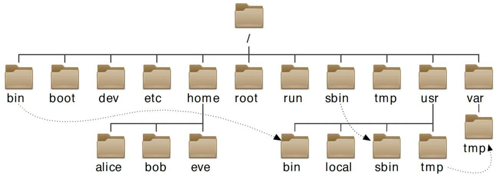

# Chapter 3 - 目录结构及命令使用

[返回](../README.md)

[TOC]

## 1. Linux 文件系统层次结构



Linux 系统中的所有文件存储在文件系统中，它们被组织到一个颠倒的目录树中，称为**文件系统层次结构**。

* `/` 目录是根目录，位于文件系统层次结构顶部

* `/bin` 用户命令，存放二进制文件

  * 不可以单独设置分区

  * 存放系统命令，普通用户和 root 都可以执行。放在 /bin 下的命令在单用户模式下也可以执行

  * ```sh
    [sadmin@server1 ~]$ ls -ld /bin
    lrwxrwxrwx. 1 root root 7 4月  23 2020 /bin -> usr/bin
    ```

* `/boot`  

  * 系统启动目录，保存与系统启动相关的文件，如内核文件和启动引导程序（grub）文件等

  * 可以设置分区

  * ```sh
    [root@server1 ~]# du -sh /boot/
    199M	/boot/
    ```

* `/dev` 设备文件，供系统访问硬件
* `/etc` 存放的是系统的配置文件
  * 系统内所有采用默认安装方式的服务配置文件全部保存在此目录中，如用户信息、服务的启动脚本、常用服务的配置文件等
* `/home` 类似于 Windows 下面的 Users 目录，用于存储用户的家目录。
* `/lib` 和 `/lib64` 存放系统调用的函数库保存位置
* `/media` 挂载目录。系统建议用来挂载媒体设备，如软盘和光盘
* `/mnt` 挂载目录。早期 Linux 中只有这一个挂载目录，并没有细分。系统建议这个目录用来挂载额外的设备，如 U 盘、移动硬盘和其他操作系统的分区
* `/opt` 第三方安装的软件保存位置。这个目录是放置和安装其他软件的位置，手工安装的源码包软件都可以安装到这个目录中。
* `/proc` 存放系统启动之后内核与进程的运行时数据。虚拟文件系统。该目录中的数据并不保存在硬盘上，而是保存到内存中。主要保存系统的内核、进程、外部设备状态和网络状态等
* `/root` root 用户的家目录
* `/run` 存储进程的 pid 信息或者套接字信息
* `/sbin` 可执行命令，保存与系统环境设置相关的命令，只有 root 可以使用这些命令进行系统环境设置，但也有些命令可以允许普通用户查看
* `/srv` 服务数据目录。一些系统服务启动之后，可以在这个目录中保存所需要的数据
* `/sys` 调整硬件的参数。虚拟文件系统。和 /proc/ 目录相似，该目录中的数据都保存在内存中，主要保存与内核相关的信息
* `/tmp` 供临时文件使用的全局可写空间。10天内未访问、更改的文件将被自动删除。
  * `/var/tmp` 30天内未访问、更改的文件将被自动删除
* `/usr` 安装的软件，共享的库，包括文件和只读程序数据
* `/var` 存放的是系统的可变数据，在系统启动之间保持永久性。比如数据库、缓存目录、日志文件。

二级目录

| /usr子目录   | 功能（作用）                                                 |
| ------------ | ------------------------------------------------------------ |
| /usr/bin/    | 存放系统命令，普通用户和超级用户都可以执行。这些命令和系统启动无关，在单用户模式下不能执行 |
| /usr/sbin/   | 存放根文件系统不必要的系统管理命令，如多数服务程序，只有 root 可以使用。 |
| /usr/lib/    | 应用程序调用的函数库保存位置                                 |
| /usr/XllR6/  | 图形界面系统保存位置                                         |
| /usr/local/  | 手工安装的软件保存位置。我们一般建议源码包软件安装在这个位置 |
| /usr/share/  | 应用程序的资源文件保存位置，如帮助文档、说明文档和字体目录   |
| /usr/src/    | 源码包保存位置。我们手工下载的源码包和内核源码包都可以保存到这里。 |
| /usr/include | C/C++ 等编程语言头文件的放置目录                             |

| /var子目录        | 功能（作用）                                                 |
| ----------------- | ------------------------------------------------------------ |
| /var/lib/         | 程序运行中需要调用或改变的数据保存位置。如 MySQL 的数据库保存在 /var/lib/mysql/ 目录中 |
| /var/log/         | 登陆文件放置的目录，其中所包含比较重要的文件如 /var/log/messages, /var/log/wtmp 等。 |
| /var/run/         | 一些服务和程序运行后，它们的 PID（进程 ID）保存位置          |
| /var/spool/       | 里面主要都是一些临时存放，随时会被用户所调用的数据，例如 /var/spool/mail/ 存放新收到的邮件，/var/spool/cron/ 存放系统定时任务。 |
| /var/www/         | RPM 包安装的 Apache 的网页主目录                             |
| /var/nis和/var/yp | NIS 服务机制所使用的目录，nis 主要记录所有网络中每一个 client 的连接信息；yp 是 linux 的 nis 服务的日志文件存放的目录 |
| /var/tmp          | 一些应用程序在安装或执行时，需要在重启后使用的某些文件，此目录能将该类文件暂时存放起来，完成后再行删除 |

## 2. 使用 cd 切换目录

```sh
cd 路径

~ 表示当前用户的家目录
cd == cd ~

~user 表示 user 的家目录

cd - 回到之前的目录
```

## 3. 管理目录

```sh
# 创建目录
mkdir directory

# -p 递归创建多级目录
mkdir -p dir1/dir2

# 删除空目录
rmdir directory

# 递归删除含有文件的目录
rm -rf directory

# 用于将一个或多个文件或目录复制到指定位置
#	考虑xx是不是一个目录，如果是，则是把file1拷贝到/path2/xx目录里
#	如果xx不是目录或者不存在，则是吧file1拷贝到/path2里，命名为xx
cp /path1/file1 /path2/xx

# cp 参数
-f	若目标文件已存在，则会直接覆盖原文件
-i	若目标文件已存在，则会询问是否覆盖
-p	保留源文件或目录的所有属性
-r	递归复制文件和目录
-a	保留其原始权限及用户归属信息

# 复制目录及其内容
cp -r directory new-directory

# 剪切 在同一个目录内对文件进行剪切的操作，实际应理解成重命名操作
mv /path1/file1 /path2/xx
```

[返回](../README.md)