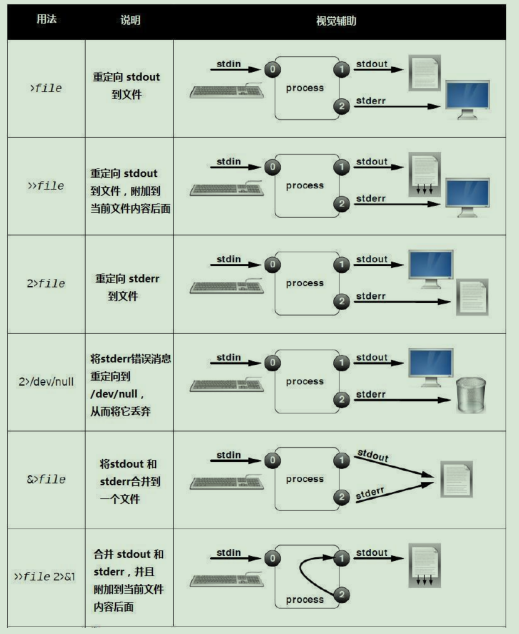

# Chapter 5 - 重定向及vim编辑器

[返回](../README.md)

[TOC]

## 1. 将输出重定向到文件或程序

### 标准输入、标准输出和标准错误

一个进程需要从某个位置读取输入，并将输出写入到某位置。

进程使用**文件描述符的编号通道**来获取输入并发送输出。所有进程在开始时至少需要三个文件描述符：

* 标准输入（通道0）：从键盘读取输入
* 标准输出（通道1）：将正常输出发送到终端
* 标准错误（通道2）：将错误消息发送到终端


通道（文件描述符）

| 编号 | 通道名称 | 描述     | 默认连接 | 用法       |
| ---- | -------- | -------- | -------- | ---------- |
| 0    | stdin    | 标准输入 | 键盘     | 仅读取     |
| 1    | stdout   | 标准输出 | 终端     | 仅写入     |
| 2    | stderr   | 标准错误 | 终端     | 仅写入     |
| 3+   | filename | 其他文件 | 无       | 读取、写入 |

### 将输出重定向到文件

I/O 重定向可以更改进程获取其输入或者输出的方式。

重定向 stdout 可以阻止进程输出显示在终端上。




* 命令` > file` 如果file不存在则创建，如果存在则覆盖写

  * ` > file` 相当于 ` 1> file` 

* 命令` >> file` 如果file不存在则创建，如果存在则追加

  * ` >> file` 相当于 ` 1>> file` 

* 命令 `2>file` 和 `2>>file` 重定向错误的输出

* 命令 `&>` 和 `&>>` 重定向正确的和错误的输出

* ```sh
  &>file 相当于 >file 2>&1
  ```

* ```sh
  &>>file 相当于 >>file 2>&1
  ```

```sh
[sadmin@server1 ~]$ date &> std.txt
[sadmin@server1 ~]$ cat std.txt 
2022年 11月 23日 星期三 22:23:33 CST
[sadmin@server1 ~]$ date1 &> std.txt
[sadmin@server1 ~]$ cat std.txt 
bash: date1: 未找到命令...
相似命令是： 'date'
```

### 构建管道

管道是一个或者多个命令的序列，用竖线分隔。在某个进程输出到终端之前，管道运行另一个进程操作和格式化该进程的输出。


```sh
# 将前一个命令的结果作为参数传递给第二个参数

# 1. 从前10行中，选择尾5行
[sadmin@server1 ~]$ head /etc/passwd | tail -5
sync:x:5:0:sync:/sbin:/bin/sync
shutdown:x:6:0:shutdown:/sbin:/sbin/shutdown
halt:x:7:0:halt:/sbin:/sbin/halt
mail:x:8:12:mail:/var/spool/mail:/sbin/nologin
operator:x:11:0:operator:/root:/sbin/nologin

[sadmin@server1 ~]$ ifconfig ens160
ens160: flags=4163<UP,BROADCAST,RUNNING,MULTICAST>  mtu 1500
        inet 192.168.26.130  netmask 255.255.255.0  broadcast 192.168.26.255
        inet6 fe80::20c:29ff:fe73:19ba  prefixlen 64  scopeid 0x20<link>
        ether 00:0c:29:73:19:ba  txqueuelen 1000  (Ethernet)
        RX packets 1217  bytes 1675636 (1.5 MiB)
        RX errors 0  dropped 0  overruns 0  frame 0
        TX packets 439  bytes 30737 (30.0 KiB)
        TX errors 0  dropped 0 overruns 0  carrier 0  collisions 0

# 使用 awk 过滤含有 inet 的行，然后选取分割后的 IP 地址
[sadmin@server1 ~]$ ifconfig ens160 | awk '/inet /{print $2}'
192.168.26.130


```

#### tee 命令

在管道中，tee 将其标准输入复制到其标准输出中，并且还将标准输出重定向到指定为命令参数的文件。

```sh

# 将中间结果保存 ens160.txt，将输出传递到 awk
[sadmin@server1 ~]$ ifconfig ens160 | tee ens160.txt | awk '/inet /{print $2}'
192.168.26.130
[sadmin@server1 ~]$ cat ens160.txt 
ens160: flags=4163<UP,BROADCAST,RUNNING,MULTICAST>  mtu 1500
        inet 192.168.26.130  netmask 255.255.255.0  broadcast 192.168.26.255
        inet6 fe80::20c:29ff:fe73:19ba  prefixlen 64  scopeid 0x20<link>
        ether 00:0c:29:73:19:ba  txqueuelen 1000  (Ethernet)
        RX packets 1219  bytes 1675806 (1.5 MiB)
        RX errors 0  dropped 0  overruns 0  frame 0
        TX packets 445  bytes 31225 (30.4 KiB)
        TX errors 0  dropped 0 overruns 0  carrier 0  collisions 0

# 追加写入操作
[sadmin@server1 ~]$ uptime | tee -a uptime.txt
 22:06:42 up 20 min,  1 user,  load average: 0.02, 0.04, 0.12
[sadmin@server1 ~]$ cat uptime.txt 
 22:06:35 up 20 min,  1 user,  load average: 0.02, 0.04, 0.12
 22:06:42 up 20 min,  1 user,  load average: 0.02, 0.04, 0.12

```

#### grep 使用

grep来自于英文词组“global search regular expression and print out the line”的缩写，意思是用于全面搜索的正则表达式，并将结果输出。

- grep 关键字 file 

- grep -i 关键字 file 忽略大小写 

- -n 显示行号 

- -v 反向过滤 

- -A5 显示关键字及后面5行 

- -B5 显示关键字及前面5行 

- -C5 显示关键字及前后5行

```sh
[sadmin@server1 ~]$ grep -n root /etc/passwd
1:root:x:0:0:root:/root:/bin/bash
10:operator:x:11:0:operator:/root:/sbin/nologin
[sadmin@server1 ~]$ grep -n -v nologin /etc/passwd
1:root:x:0:0:root:/root:/bin/bash
6:sync:x:5:0:sync:/sbin:/bin/sync
7:shutdown:x:6:0:shutdown:/sbin:/sbin/shutdown
8:halt:x:7:0:halt:/sbin:/sbin/halt
46:sadmin:x:1000:1000:sadmin:/home/sadmin:/bin/bash
```
