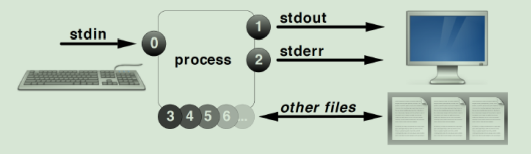
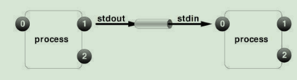

# Chapter 5 - 重定向及vim编辑器

[返回](../README.md)

[TOC]

## 1. 将输出重定向到文件或程序

### 标准输入、标准输出和标准错误

一个进程需要从某个位置读取输入，并将输出写入到某位置。

进程使用**文件描述符的编号通道**来获取输入并发送输出。所有进程在开始时至少需要三个文件描述符：

* 标准输入（通道0）：从键盘读取输入
* 标准输出（通道1）：将正常输出发送到终端
* 标准错误（通道2）：将错误消息发送到终端



通道（文件描述符）

| 编号 | 通道名称 | 描述     | 默认连接 | 用法       |
| ---- | -------- | -------- | -------- | ---------- |
| 0    | stdin    | 标准输入 | 键盘     | 仅读取     |
| 1    | stdout   | 标准输出 | 终端     | 仅写入     |
| 2    | stderr   | 标准错误 | 终端     | 仅写入     |
| 3+   | filename | 其他文件 | 无       | 读取、写入 |

### 将输出重定向到文件

I/O 重定向可以更改进程获取其输入或者输出的方式。

重定向 stdout 可以阻止进程输出显示在终端上。


* 命令` > file` 如果file不存在则创建，如果存在则覆盖写

  * ` > file` 相当于 ` 1> file` 

* 命令` >> file` 如果file不存在则创建，如果存在则追加

  * ` >> file` 相当于 ` 1>> file` 

* 命令 `2>file` 和 `2>>file` 重定向错误的输出

* 命令 `&>` 和 `&>>` 重定向正确的和错误的输出

* ```sh
  &>file 相当于 >file 2>&1
  ```

* ```sh
  &>>file 相当于 >>file 2>&1
  ```

```sh
[sadmin@server1 ~]$ date &> std.txt
[sadmin@server1 ~]$ cat std.txt 
2022年 11月 23日 星期三 22:23:33 CST
[sadmin@server1 ~]$ date1 &> std.txt
[sadmin@server1 ~]$ cat std.txt 
bash: date1: 未找到命令...
相似命令是： 'date'
```

### 构建管道

管道是一个或者多个命令的序列，用竖线分隔。在某个进程输出到终端之前，管道运行另一个进程操作和格式化该进程的输出。



```sh
# 将前一个命令的结果作为参数传递给第二个参数

# 1. 从前10行中，选择尾5行
[sadmin@server1 ~]$ head /etc/passwd | tail -5
sync:x:5:0:sync:/sbin:/bin/sync
shutdown:x:6:0:shutdown:/sbin:/sbin/shutdown
halt:x:7:0:halt:/sbin:/sbin/halt
mail:x:8:12:mail:/var/spool/mail:/sbin/nologin
operator:x:11:0:operator:/root:/sbin/nologin

[sadmin@server1 ~]$ ifconfig ens160
ens160: flags=4163<UP,BROADCAST,RUNNING,MULTICAST>  mtu 1500
        inet 192.168.26.130  netmask 255.255.255.0  broadcast 192.168.26.255
        inet6 fe80::20c:29ff:fe73:19ba  prefixlen 64  scopeid 0x20<link>
        ether 00:0c:29:73:19:ba  txqueuelen 1000  (Ethernet)
        RX packets 1217  bytes 1675636 (1.5 MiB)
        RX errors 0  dropped 0  overruns 0  frame 0
        TX packets 439  bytes 30737 (30.0 KiB)
        TX errors 0  dropped 0 overruns 0  carrier 0  collisions 0

# 使用 awk 过滤含有 inet 的行，然后选取分割后的 IP 地址
[sadmin@server1 ~]$ ifconfig ens160 | awk '/inet /{print $2}'
192.168.26.130


```

#### tee 命令

在管道中，tee 将其标准输入复制到其标准输出中，并且还将标准输出重定向到指定为命令参数的文件。

```sh

# 将中间结果保存 ens160.txt，将输出传递到 awk
[sadmin@server1 ~]$ ifconfig ens160 | tee ens160.txt | awk '/inet /{print $2}'
192.168.26.130
[sadmin@server1 ~]$ cat ens160.txt 
ens160: flags=4163<UP,BROADCAST,RUNNING,MULTICAST>  mtu 1500
        inet 192.168.26.130  netmask 255.255.255.0  broadcast 192.168.26.255
        inet6 fe80::20c:29ff:fe73:19ba  prefixlen 64  scopeid 0x20<link>
        ether 00:0c:29:73:19:ba  txqueuelen 1000  (Ethernet)
        RX packets 1219  bytes 1675806 (1.5 MiB)
        RX errors 0  dropped 0  overruns 0  frame 0
        TX packets 445  bytes 31225 (30.4 KiB)
        TX errors 0  dropped 0 overruns 0  carrier 0  collisions 0

# 追加写入操作
[sadmin@server1 ~]$ uptime | tee -a uptime.txt
 22:06:42 up 20 min,  1 user,  load average: 0.02, 0.04, 0.12
[sadmin@server1 ~]$ cat uptime.txt 
 22:06:35 up 20 min,  1 user,  load average: 0.02, 0.04, 0.12
 22:06:42 up 20 min,  1 user,  load average: 0.02, 0.04, 0.12

```

#### grep 使用

grep来自于英文词组“global search regular expression and print out the line”的缩写，意思是用于全面搜索的正则表达式，并将结果输出。

- grep 关键字 file 

- grep -i 关键字 file 忽略大小写 

- -n 显示行号 

- -v 反向过滤 

- -A5 显示关键字及后面5行 

- -B5 显示关键字及前面5行 

- -C5 显示关键字及前后5行

```sh
[sadmin@server1 ~]$ grep -n root /etc/passwd
1:root:x:0:0:root:/root:/bin/bash
10:operator:x:11:0:operator:/root:/sbin/nologin
[sadmin@server1 ~]$ grep -n -v nologin /etc/passwd
1:root:x:0:0:root:/root:/bin/bash
6:sync:x:5:0:sync:/sbin:/bin/sync
7:shutdown:x:6:0:shutdown:/sbin:/sbin/shutdown
8:halt:x:7:0:halt:/sbin:/sbin/halt
46:sadmin:x:1000:1000:sadmin:/home/sadmin:/bin/bash
```

## 2. vim 编辑器

Linux 的一个重要设计原则是：信息和配置设置都存储在基于文本的文件中。Linux 上流行的文本编辑器是 vim，vi 是由 POSIX 标准指定的。

* 轻量级安装 -- vim-minimal 软件包，仅包含核心功能集和基本 vi 命令。可以使用 `vi filename` 打开文件进行编辑
* 完整安装 -- vim-enhanced 软件包，包含增强功能。可以使用 `vim filename` 打开文件进行编辑

Vim 有几个运行模式：命令模式、扩展命令模式、编辑模式和可视模式。

### 命令模式

第一次打开 Vim，会以命令模式启动，可以用于导航、剪切和粘贴。

#### 复制粘贴

复制：`nyy` 从当前光标所在行（包含），往下复制 n 行

粘贴：`p`

剪切：`ndd` 剪切 n 行，如果不粘贴，则相当于删除 n 行

#### 撤销与重做

撤销更改：`u`

重做更改：`Ctrl + r`

#### 删除字符

`x` 删除光标所在的字符

`nx` 删除光标所在位置往后的 n 个字符

#### 替换字符

`r` 替换光标所在位置的单个字符，替换完退出

`R` 替换光标所在位置的单个字符，并一直保持替换模式，直到完成退出。

#### 导航

`nG` 定位到第 n 行

`G` 定位到最后一行

`gg` 定位到第一行

#### 保存并退出

`ZZ`

### 插入模式

在命令模式状态下输入 i、I、a、A、o、O 等插入命令进入编辑模式

| 快捷键 | 功能描述                                                     |
| ------ | ------------------------------------------------------------ |
| `i`    | 在当前光标所在位置插入随后输入的文本，光标后的文本相应向右移动 |
| `I`    | 在光标所在行的行首插入随后输入的文本，行首是该行的第一个非空白字符，相当于光标移动到行首执行 i 命令 |
| `o`    | 在光标所在行的下面插入新的一行。光标停在空行首，等待输入文本 |
| `O`    | 在光标所在行的上面插入新的一行。光标停在空行的行首，等待输入文本 |
| `a`    | 在当前光标所在位置之后插入随后输入的文本                     |
| `A`    | 在光标所在行的行尾插入随后输入的文本，相当于光标移动到行尾再执行a命令 |

### 扩展命令模式（末行模式）

#### 查询

输入 `/`，进入查询模式。

* 输入关键字查询 `/keyword` 区分大小写。输入 `Enter` 确认查询结果。

  

* 输入关键字查询 `/keyword\c` 不区分大小写。输入 `Enter` 确认查询结果。

  * 如果查询结果有多个，按 `n` 显示下一个匹配内容，按 `N` 显示上一个匹配内容。

  

#### 文件保存、另存为和退出

输入 `:` 进入其他扩展命令模式

* `:w` 保存当前更改
* `:w /tmp/newfile.txt` 将当前修改保存到 `/tmp/newfile.txt`
* `:q!` 强制退出，不保存更改
* `:wq` 退出，保存更改；或者输入 `x`

#### 插入其他内容

* `:r /path/to/file` 在光标所在位置，插入读取的文件内容
* 

* `:.! 命令` 将命令的结果覆盖显示到光标所在行。
* 

#### 设置 Vim 参数

* `:set nu` 显示行号
  * `:数字` 跳转到对应的行
* `:set paste` 复制的时候保持格式
* `:set cul` 设置当前所在行高亮；`:set nocul` 取消当前所在行高亮
* `:set cuc` 设置当前所在列高亮；`:set nocuc` 取消当前所在行高亮

使参数设置永久生效

* 在用户的家目录下，编辑 `.vimrc` -- 针对当前用户；或者编辑 `/etc/vimrc` 针对所有用户

  ```sh
  set nu
  set paste
  set cuc
  set cul
  ```

#### 替换操作

* `:s/oldStr/newStr/` 替换当前行（光标所在行）第一个匹配的字符串
* `:s/oldStr/newStr/g` 替换当前行（光标所在行）所有匹配的字符串
* `:m,ns/oldStr/newStr/g` 替换从第m行到第n行，所有匹配的字符串
* `.` 表示当前行，`$` 表示最后一行，`$-1` 表示倒数第二行，`1,$` 表示所有行，`%` 表示所有行

### 视图模式

在命令模式下按 `v` 进入视图模式。

按住 `Shift + v` ，可以选择行文本。

按住 `Ctrl + v` ，可以选择文本块。

* 选择文本块后，按住 y 复制，然后 p 粘贴


#### 多行注释

* `Ctrl + v` 进入视图块，将光标移到需要注释的开头行，然后移动光标选择多行。
* 输入`I` 也就是 `Shift + i` 在每行开头插入模式，输入 `#`
* 按 `Esc` 在每行开头插入 #


#### 取消多行注释

- `Ctrl + v` 进入视图块，将光标移到需要取消注释的开头行，然后移动光标选择多行。
- 按 `x` 删除 `#` 注释


#### 多行缩进

* 设置缩进空格为4 `:set shiftwidth=4`
* `Ctrl + v` 进入视图块，选中需要缩进的行
* `Shift + >` 进行duo'hang

### 其他 Vim 操作

* 同时打开多个文件，可以用来比较文件内容

`vim -O file1 file2`


`Ctrl + w + w` 在多个屏幕之间切换

### 光标导航

**h**ang back

**j**ump down

**k**ick up

**l**eap forward

[返回](../README.md)
