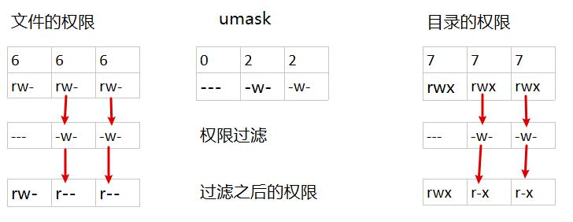

# Chapter 7 - 权限管理

[返回](../README.md)

[TOC]

## 1. 使用 `chown` 和 `chgrp` 管理文件的所有者

chown命令来自于英文词组”Change owner“的缩写，其功能是用于**改变文件或目录的用户和用户组信息**。管理员可以改变一切文件的所属信息，而普通用户只能改变自己文件的所属信息。

### 查看文件和目录的权限及所有权

`ls -l` 命令可以显示有关权限和所有权的详细信息。

```sh
[root@server1 ~]# ls -l myfile.txt 
-rw-r--r--. 1 root root 21 12月  8 12:12 myfile.txt
```

### 修改所有者

```sh
[root@server1 ~]# chown sadmin myfile.txt 
[root@server1 ~]# ls -l myfile.txt 
-rw-r--r--. 1 sadmin root 21 12月  8 12:12 myfile.txt
```

### 修改所属组 `.groupname` 或者 `:groupname`

```sh
[root@server1 ~]# chown .sadmin myfile.txt 
[root@server1 ~]# ls -l myfile.txt 
-rw-r--r--. 1 sadmin sadmin 21 12月  8 12:12 myfile.txt

# 或者
[root@server1 ~]# chown :sadmin myfile.txt 

# 或者使用 chgrp group1 myfile.txt
```

### 同时修改所有者和所属组

```sh
[root@server1 ~]# chown root:root myfile.txt 
[root@server1 ~]# ls -l myfile.txt 
-rw-r--r--. 1 root root 21 12月  8 12:12 myfile.txt
```

### 如果要递归修改目录和文件的所有者，可以加上 `-R` 参数

```sh
[root@server1 ~]# mkdir xx
[root@server1 ~]# touch xx/hosts
chown -R sadmin myfile.txt 
chgrp -R sadmin xx
```

## 2. 文件系统权限

有三种权限类别：读取（r）、写入（w）和执行（x）

| 权限     | 对文件影响       | 对目录影响                                                   |
| -------- | ---------------- | ------------------------------------------------------------ |
| r (读取) | 读取文件内容     | 列出目录的内容（文件名）                                     |
| w (写入) | 更改文件内容     | 创建或删除目录中的任一文件                                   |
| x (执行) | 作为命令执行文件 | 目录可以成为当前的工作目录（可以 `cd`，但是还需要读取权限才能列出里面的内容） |

`ls -l` 长列表形式可以显示有关权限和所有权的信息。

```sh
[sadmin@server1 ~]$ ls -l msg.txt 
-rw-rw-r--. 1 sadmin sadmin 28 12月  4 12:53 msg.txt
```

### 2.1 长列表的第一个字符表示**文件类型**

- `-` 普通文件
- `l` 软连接
- `b` 可存储设备文件
- `c` 不可存储设备文件

### 2.2 长列表的第二到十个字符表示文件权限

文件权限分为三组，每组三个字符，分别对应：

* 文件所有者权限 (u)
* 文件所属组权限 (g)
* 文件对应的其他所有用户的权限 (o)

### 2.3 使用 `chmod` 更改权限

chmod命令来自于英文词组”change mode“的缩写，其功能是用于改变文件或目录权限的命令。默认只有文件的所有者和管理员可以设置文件权限，普通用户只能管理自己文件的权限属性。

#### 通过符号法更改权限

```sh
chmod whowhatwhich file|directory
```

* who 代表 `u`, `g`, `o`, `a` （用户、组、其他、全部）
* what 代表 `+`, `-`, `=` （添加、删除、精确设置）
* which 代表 `r`, `w`, `x` （读取，写入、执行）

```sh
[root@server1 opt]# ls -l hosts 
-rw-r--r--. 1 root root 158 12月 18 15:59 hosts
[root@server1 opt]# chmod o-r hosts 
[sadmin@server1 opt]$ cat hosts 
cat: hosts: 权限不够
[root@server1 opt]# chmod g-r,o+r hosts 
[sadmin@server1 opt]$ cat hosts 
127.0.0.1   localhost localhost.localdomain localhost4 localhost4.localdomain4
::1         localhost localhost.localdomain localhost6 localhost6.localdomain6

[root@server1 opt]# chmod a=rw hosts
[root@server1 opt]# 
[root@server1 opt]# ls -l hosts
-rw-rw-rw-. 1 root root 162 12月 18 16:05 hosts
[sadmin@server1 opt]$ echo 111 >> hosts 
[sadmin@server1 opt]$ cat hosts 
127.0.0.1   localhost localhost.localdomain localhost4 localhost4.localdomain4
::1         localhost localhost.localdomain localhost6 localhost6.localdomain6
111
```

#### 通过数值法更改权限

```sh
chmod ### file|directory
```

* `#` 代表一个数字，每个数字代表一个访问级别的权限。
* 数字的计算方法是：将所要添加的每个权限的数值加在一起。`4` 代表 `r` 读取，`2` 代表 `w` 写入，`1` 代表 `x` 执行。
  * `rwx` 计算为 4+2+1=7
  * `rw-` 计算为 4+2+0=6
  * `r-x` 计算为 4+0+1=5
  * `r--` 计算为 4+0+0=4
  * `-wx` 计算为 0+2+1=3
  * `-w-` 计算为 0+2+0=2
  * `--x` 计算为 0+0+1=1
  * `---` 计算为 0+0+0=0

```sh
chmod 755 myfile
chmod 777 mydir
```

### 2.4 默认权限

```sh
[root@server1 opt]# touch f1 f2
[root@server1 opt]# mkdir dir1 dir2
[root@server1 opt]# ls -l
总用量 0
drwxr-xr-x. 2 root root 6 12月 18 16:23 dir1
drwxr-xr-x. 2 root root 6 12月 18 16:23 dir2
-rw-r--r--. 1 root root 0 12月 18 16:23 f1
-rw-r--r--. 1 root root 0 12月 18 16:23 f2
```

在创建新文件或者目录时，会为其分配初始权限。

* 在**创建文件时**，最大的文件权限是八进制 `0666` (-rw-rw-rw-)；在**创建目录时**，最大的目录权限是八进制`0777` (drwxrwxrwx)

* `shell` 会设置一个 `umask` ，从而进一步限制初始设置的权限。这是一个八进制的掩码，用于清除由该进程创建的新文件和新目录的权限。

  * `umask` 相当于权限的过滤符

  * `umask` 为 0002 可以清除其他用户的写入位

  * `umask` 为 0077 可以清除文件所有组和其他权限

  * 显示 shell 的当前 umask 值

  * ```sh
    [root@server1 opt]# umask
    0022
    ```

* 所以当前系统中，新建文件的权限是 `644`，新建目录的权限是 `755`



* 目录的默认权限 = `777 - umask`，文件的默认权限 = 666 - (umask 每个奇数位 - 1)

  * umask = 333, 文件权限 = 666 - (333 - 111) = 444；目录权限 = 777 - 333 = 444

  * ```sh
    [root@server1 opt]# umask 333
    [root@server1 opt]# touch f1 f2 ; mkdir d1 d2
    [root@server1 opt]# ls -l
    总用量 0
    dr--r--r--. 2 root root 6 12月 18 16:52 d1
    dr--r--r--. 2 root root 6 12月 18 16:52 d2
    -r--r--r--. 1 root root 0 12月 18 16:52 f1
    -r--r--r--. 1 root root 0 12月 18 16:52 f2
    ```

### 2.5 特殊权限位

特殊权限提供了额外的访问功能，超出了基本权限类型允许的范畴。

| 特殊权限    | 对文件的影响                                                 | 对目录的影响                                                 |
| ----------- | ------------------------------------------------------------ | ------------------------------------------------------------ |
| u+s (suid)  | 以文件所有者的用户身份，而不是以运行文件的用户身份执行文件。当某可执行命令的所有者的位置上有 s 位的话，那么当普通用户再执行这个命令的时候将具有所有者的权限。 | 无影响                                                       |
| g+s (sgid)  | 以文件所属组身份执行文件                                     | 在目录中，最新创建的文件将其所属组设置为与目录的所属组相匹配。如果目录所属组的位置上有s位的话，则不管是谁在此目录下创建的新文件或者目录，都会继承此目录所属组。 |
| o+t(sticky) | 无影响                                                       | 对目录具有写入访问权限的用户仅可以删除其所拥有的文件，而无法删除或强制保存到其他用户所拥有的文件。如果某个目录o位置上有t位的话，那么此目录里的文件除了所有者和root 之外，其他用户即使对此文件具有所有权限，也没法删除此文件。 |

#### `setuid`

对可执行文件的 `setuid` 权限表示将以拥有该文件的用户的身份运行命令，而不是运行命令的用户身份，这里以 `passwd` 为例

```sh
[sadmin@server1 opt]$ ls -l /etc/shadow
----------. 1 root root 1471 12月  7 21:33 /etc/shadow
[sadmin@server1 opt]$ 
[sadmin@server1 opt]$ ls -l $(which passwd)
-rwsr-xr-x. 1 root root 33544 12月 14 2019 /usr/bin/passwd
```

* 这里显示的是小写的 `s` ，标志 setuid 权限。通常该处是小写的 x （所有者执行权限）。如果所有者不具有执行权限，则使用大写的 `S` 表示。

#### `setgid`

对目录的特殊权限 `setgid` 表示在**该目录中创建的文件将继承该目录的所属组所有权**，而不是继承自创建用户。通常用于协作目录，将文件从专有组自动更改为共享组，或者目录中的文件始终都应由特定的组使用。

```sh
[root@server1 opt]# ls -ld /run/log/journal/
drwxr-sr-x. 3 root systemd-journal 60 12月 18 15:36 /run/log/journal/
```

如果对可执行文件设置了`setgid`，则命令以拥有该文件的所属组运行，而不是以运行命令的用户身份运行。类似于 `setuid`

```sh
[root@server1 opt]# ls -ld /usr/bin/locate
-rwx--s--x. 1 root slocate 47128 8月  12 2018 /usr/bin/locate
```

* 可以通过小写的 s 判断 setgid 权限，该处通常是 x （组执行权限）。如果组不具有执行权限，将会由大写的 `S` 表示。

#### `sticky`

针对目录的粘滞位将对**文件删除设置特殊限制**。只有文件的所有者及 root 才能删除该目录中的文件。比如搭建文件服务器的时候，防止其他人误删除文件。

```sh
[root@server1 opt]# ls -ld /tmp/
drwxrwxrwt. 11 root root 4096 12月 19 11:29 /tmp/
```

可以通过小写的 t 判断 sticky 权限，该处通常是 x （组执行权限）。如果组不具有执行权限，将会由大写的 `T` 表示。

#### 设置特殊权限位

* 符号法：setuid=u+s; setgid=g+s; sticky=o+s

```sh
[root@server1 opt]# mkdir mydir
[root@server1 opt]# ls -ld mydir/
dr--r--r--. 2 root root 6 12月 19 11:41 mydir/
[root@server1 opt]# 
[root@server1 opt]# chmod u+s,g+s,o+t mydir/
[root@server1 opt]# ls -ld mydir/
dr-Sr-Sr-T. 2 root root 6 12月 19 11:41 mydir/
```

* 数值法（第四位）：setuid=4; setgid=2; sticky=1

```sh
[root@server1 opt]# mkdir newdir
[root@server1 opt]# ls -ld newdir/
dr--r--r--. 2 root root 6 12月 19 11:42 newdir/
[root@server1 opt]# chmod 6444 newdir/
[root@server1 opt]# ls -ld newdir/
dr-Sr-Sr--. 2 root root 6 12月 19 11:42 newdir/
[root@server1 opt]# chmod 7444 newdir/
[root@server1 opt]# ls -ld newdir/
dr-Sr-Sr-T. 2 root root 6 12月 19 11:42 newdir/
```

### 2.6 文件或目录的隐藏权限

#### lsattr命令 – 显示文件的隐藏属性

lsattr命令来自于英文词组“list attribute”的缩写，其功能是用于显示文件的隐藏属性。

隐藏属性也叫隐藏权限，顾名思义就是用chattr命令添加在文件上的隐藏权限属性，用常规ls命令无法查看到它们，需要使用`lsattr`命令查看这些属性信息。

```sh
[root@server1 opt]# lsattr -d mydir/
-------------------- mydir/
[root@server1 opt]# lsattr hosts 
-------------------- hosts
```

#### chattr命令 – 更改文件隐藏属性

chattr命令来自于英文词组“change attribute”的缩写，其功能是用于更改文件隐藏属性。

常用的ls命令仅能够查看到文件的一般权限、特殊权限、SELinux安全上下文与是否有FACL访问控制列表等情况，但却无法查看到文件隐藏属性。

`chattr 参数 文件`

| 操作 | 说明                     |
| ---- | ------------------------ |
| +    | 开启文件或目录的该项属性 |
| -    | 关闭文件或目录的该项属性 |
| =    | 指定文件或目录的该项属性 |


| 权限 | 作用                                                         |
| ---- | ------------------------------------------------------------ |
| i    | 无法对文件进行修改；若对目录设置了该参数，则仅能修改其中的子文件内容而不能新建或删除文件 |
| a    | 仅允许补充（追加）内容，无法覆盖/删除内容（Append Only）     |

```sh
# i 只能增加，不能删除
[root@server1 opt]# chattr +i hosts
[root@server1 opt]# lsattr hosts 
----i--------------- hosts
[root@server1 opt]# echo 123 >> hosts
-bash: hosts: 不允许的操作
[root@server1 opt]# 
[root@server1 opt]# chattr +i mydir/
[root@server1 opt]# lsattr -d mydir/
----i--------------- mydir/
[root@server1 opt]# touch mydir/newfile
touch: 正在设置 'mydir/newfile' 的时间: 没有那个文件或目录

# a 不能增加，也不能删除
[root@server1 opt]# chattr +a hosts 
[root@server1 opt]# lsattr hosts 
-----a-------------- hosts
[root@server1 opt]# echo 123 > hosts 
-bash: hosts: 不允许的操作
[root@server1 opt]# echo 123 >> hosts 
[root@server1 opt]# tail -3 hosts 
127.0.0.1   localhost localhost.localdomain localhost4 localhost4.localdomain4
::1         localhost localhost.localdomain localhost6 localhost6.localdomain6
123
```

[返回](../README.md)