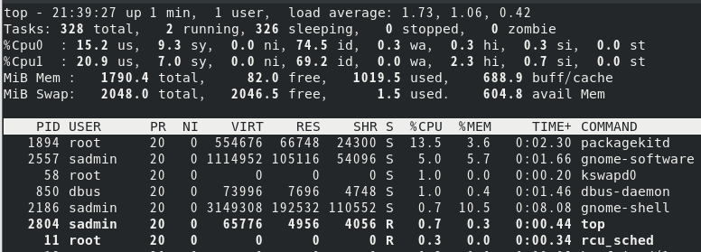

# Chapter 8 - 进程管理

[返回](../README.md)

[TOC]

## 1. 进程的定义

进程是已经启动的**可执行程序的运行中的实例**。进程由以下部分组成：

* 已分配内存的地址空间
* 安全属性，包括所有权凭据和特权
* 程序代码的一个或多个执行线程
* 进程状态

进程的环境包括：

* 本地和全局变量
* 当前调度上下文
* 分配的系统资源，如文件描述符和网络端口

父进程复制(**fork**)自己的地址空间来创建一个新的（子）进程结构。

* 每个新进程分配了一个唯一的进程ID（PID）
* PID 和父进程ID(PPID) 是新进程环境的元素。
* 任何进程都可以创建子进程。
* **所有的进程都是第一个系统进程(systemd) [pid=1] 的后代**。

### 进程的生命周期


* 通过 fork 进程，子进程继承了安全性身份、过去和当前的文件描述符、端口和资源特权、环境变量以及程序代码。

* 随后，子进程可以 exec 自己的程序代码。而**父进程在子进程运行期间处于睡眠状态**，同时设置了一个在子进程完成时发出信号的请求(wait)。

* 子进程退出时，已经关闭和丢弃了其资源和环境，唯一剩下的资源为 zombie，是进程表中的一个条目。

* 父进程在子进程退出时收到信号被唤醒，然后清理子条目的进程表，释放子进程的最后一个资源。

* 然后父进程继续执行自己的程序代码。

僵尸进程：一个进程使用 fork 创建子进程，如果子进程退出，而父进程并没有调用 wait 或 waitpid 获取子进程的状态信息，那么子进程的进程描述符仍然保存在系统中。这种进程称之为僵尸进程。

## 2. 进程的状态

在多任务处理操作系统中，每个CPU在一个时间点上处理一个进程。在进程运行时，它对CPU时间和资源的直接要求会有变化。

进程分配有一个状态，它随着环境的要求而改变。

| 名称   | 标志 | 内核定义的状态名称和描述                                     |
| ------ | ---- | ------------------------------------------------------------ |
| 运行   | 红   | TASK_RUNNING: 进程正在CPU上执行，或者正在等待运行。处于运行中（或可运行）状态时，进程可能正在执行用户例程或内核例程，或者已排队并就绪。 |
| 睡眠   | S    | TASK_INTERRUPTIBLE: 进程正在等待某一条件 -- 硬件请求、系统资源访问或信号。当事件或信号满足该条件时，该进程将返回到运行中。 |
| 睡眠   | D    | TASK_UNINTERRUPTIBLE: 此进程在睡眠，但是与S状态不同，不会响应信号。仅在进程中断可能会导致意外设备状态的情况下使用。 |
| 睡眠   | K    | TASK_KILLABLE: 与不可中断的D状态相同，但允许等待中的任务响应要被中断（彻底退出）的信号。 |
| 睡眠   | I    | TASK_REPORT_IDLE: D状态的一个子集。                          |
| 已停止 | T    | TASK_STOPPED: 进程已被停止（暂停），通常是通过用户或其他进程发出的信号。 |
| 已停止 | T    | TASK_TRACED: 正在被调试的进程也会临时停止，共享一个T状态标志 |
| 僵停   | Z    | EXIT_ZOMBIE: 子进程在退出时向父进程发出信号。除PID之外的所有资源都已被释放。 |
| 僵停   | X    | EXIT_DEAD: 当父进程清理（获取）剩余的子进程结构时，进程现在已彻底释放。 |

## 3. 列出进程

### `top`

实时显示系统运行的状态。按 `1` 可以显示多个 `cpu` 信息，按 `z` 更换颜色。

```sh
# 默认每3秒刷新一次。
top

# 每一秒刷新一次
top -d 1
```



### `ps`

`ps` 命令用于列出当前的进程。ps 来自于 process status 的缩写。

基本上不同版本的 unix 系统上都有自己的 ps 命令，但是这些命令却没有一个统一的选项约定。Linux 版本的 ps 支持 Unix(POSIX) 风格和Linux风格（BSD，GNU）

* `ps aux` 显示包括无控制终端的进程在内的所有进程。
* `ps lax` 长列表显示更多的技术详细信息，避免查询用户名，可以加快显示进程信息。
* `ps -ef` Unix 风格的显示所有的进程

默认情况下，如果直接运行 `ps`， 将显示当前终端里面的进程。


进程信息常见的列

* USER 进程所属用户 

* PID 进程ID 

* %CPU 进程占用CPU百分比 

* %MEM 进程占用内存百分比 

* VSZ 虚拟内存占用大小 单位：kb 

* RSS 实际内存占用大小 单位：kb 

* TTY 终端类型：`?` 表示为后台进程

* STAT 进程状态 

* START 进程启动时刻 

* TIME 进程运行时长 

* COMMAND 启动进程的命令

### 查看进程 pid

* `ps aux | grep -v grep | grep firefox`


* `pidof firefox`  查找服务进程的 ID，进程名称必须完全匹配

  ```sh
  [root@server1 sadmin]# pidof firefox 
  3476 3395 3386 3338 3321 3236
  ```

* `pgrep firef` 查找服务进程的 ID，支持正则表达式搜索

  ```sh
  [root@server1 sadmin]# pgrep firefox
  3236
  [root@server1 sadmin]# pgrep -f firefox
  3236
  3321
  3338
  3386
  3395
  3476
  3702
  ```

## 4. 中断进程

通常使用信号来控制进程，系统中信号有：

```sh
[root@server1 sadmin]# kill -l
 1) SIGHUP	 2) SIGINT	 3) SIGQUIT	 4) SIGILL	 5) SIGTRAP
 6) SIGABRT	 7) SIGBUS	 8) SIGFPE	 9) SIGKILL	10) SIGUSR1
11) SIGSEGV	12) SIGUSR2	13) SIGPIPE	14) SIGALRM	15) SIGTERM
16) SIGSTKFLT	17) SIGCHLD	18) SIGCONT	19) SIGSTOP	20) SIGTSTP
21) SIGTTIN	22) SIGTTOU	23) SIGURG	24) SIGXCPU	25) SIGXFSZ
26) SIGVTALRM	27) SIGPROF	28) SIGWINCH	29) SIGIO	30) SIGPWR
31) SIGSYS	34) SIGRTMIN	35) SIGRTMIN+1	36) SIGRTMIN+2	37) SIGRTMIN+3
38) SIGRTMIN+4	39) SIGRTMIN+5	40) SIGRTMIN+6	41) SIGRTMIN+7	42) SIGRTMIN+8
43) SIGRTMIN+9	44) SIGRTMIN+10	45) SIGRTMIN+11	46) SIGRTMIN+12	47) SIGRTMIN+13
48) SIGRTMIN+14	49) SIGRTMIN+15	50) SIGRTMAX-14	51) SIGRTMAX-13	52) SIGRTMAX-12
53) SIGRTMAX-11	54) SIGRTMAX-10	55) SIGRTMAX-9	56) SIGRTMAX-8	57) SIGRTMAX-7
58) SIGRTMAX-6	59) SIGRTMAX-5	60) SIGRTMAX-4	61) SIGRTMAX-3	62) SIGRTMAX-2
63) SIGRTMAX-1	64) SIGRTMAX	

```

每个信号都有一个默认操作，通常是

* 终止(`Ctrl + C`) - 导致程序立即退出
* 核心转储 (`Ctrl + \`) - 导致程序立即保存内存镜像，然后退出
* 停止(`Ctrl + Z`) - 导致程序停止执行，再等待继续。

通常在我们关闭程序的时候，系统会为我们发送不同的信号

* 通过 X 关闭程序，系统会给对应的进程发送 `15` 号 `SIGTERM`信号
* 通过 Ctrl + C 关闭程序，系统会给对应的进程发送 `2` 号 `SIGINT`信号

## 5. 进程优先级

进程的优先级由两个值决定：优先顺序（priority）和优先级（niceness）。

* 优先顺序（priority）是由内核对它进行动态的更改，不需要干预
* 用户只需要关心优先级（niceness）
* nice 值的取值范围在 `-20~19`，值越小，优先级越高

### `lscpu`

该命令用于显示系统由多少 cpu，它会从 `/proc/cpuinfo` 文件中收集有关本机 CPU 架构的信息

```sh
[root@server1 ~]# lscpu
架构：           x86_64
CPU 运行模式：   32-bit, 64-bit
字节序：         Little Endian
CPU:             2
在线 CPU 列表：  0,1
每个核的线程数： 1
每个座的核数：   2
```

修改可用的 cpu 个数为1

```sh
[root@server1 ~]# cat /sys/devices/system/cpu/cpu1/online
1
[root@server1 ~]# echo 0 > /sys/devices/system/cpu/cpu1/online
[root@server1 ~]# cat /sys/devices/system/cpu/cpu1/online
0
[root@server1 ~]# lscpu
架构：           x86_64
CPU 运行模式：   32-bit, 64-bit
字节序：         Little Endian
CPU:             2
在线 CPU 列表：  0
离线 CPU 列表：  1
每个核的线程数： 1
每个座的核数：   1

```

抢占 CPU

```sh
# 创建后台一直运行的 cat 进程
cat /dev/zero > /dev/null &
[root@server1 ~]# cat /dev/zero > /dev/null &
[1] 3159
[root@server1 ~]# cat /dev/zero > /dev/null &
[2] 3160

# 将 PID 3159 的优先级设置为 -3
[root@server1 ~]# renice -n -3 3159
3159 (process ID) 旧优先级为 0，新优先级为 -3

# 运行 top 命令可以看到 PID 3159 的 CPU 使用率比 PID 3160 的 CPU 使用率高
    PID USER      PR  NI    VIRT    RES    SHR S  %CPU  %MEM     TIME+ COMMAND                                         
   3159 root      17  -3    7660   1968   1744 R  63.6   0.1   1:48.79 cat                                             
   3160 root      20   0    7660   1972   1744 R  32.8   0.1   1:22.39 cat                                             
   2218 sadmin    20   0 3433856 197280 111928 R   1.7  10.8   0:14.39 gnome-shell                                     
   2806 sadmin    20   0  617496  61692  46404 S   0.7   3.4   0:02.41 gnome-terminal- 
   
killall -9 cat
```

还原可用CPU个数

```sh
[root@server1 ~]# echo 1 > /sys/devices/system/cpu/cpu1/online
```

## 6. 后台运行程序

任何命令或管道都可以在后台启动，只需要在命令行结尾处附加 & 即可。

然后通过 `jobs` 命令显示 Bash 为特定会话跟踪的作业列表

```sh
[sadmin@server1 ~]$ sleep 60 &
[2] 3648
[sadmin@server1 ~]$ jobs
[1]-  运行中               nohup firefox &> /dev/null &
[2]+  运行中               sleep 60 &
```

`fg` %作业ID 将后台命令转至前台

```sh
[sadmin@server1 ~]$ fg %1
nohup firefox &> /dev/null
```

`ctrl + z` 将前台进程发送到后台

`bg` %作业ID 启动在后台暂停的进程

```sh
[sadmin@server1 ~]$ bg %1
[1]+ nohup firefox &> /dev/null &
```

