# Chapter 1 - 安装 RHEL 8

[返回](../README.md)

[TOC]

## 1. 安装配置 VM 虚拟机

> 实验使用 VMWare Workstation 16 虚拟机软件安装配置RHEL8系统。

### 1.1 配置网段

在 VMWare 里打开 “编辑 --> 虚拟网络编辑器”，配置 **VMnet8** 网络：

* 类型为：NAT 模式
* 子网 IP 为：`192.168.26.0`
* 子网掩码为：`255.255.255.0`

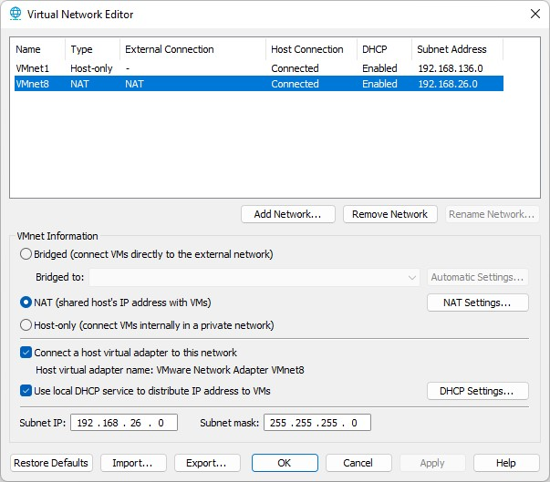

### 1.2 新建虚拟机

* 创建新的虚拟机--> 自定义（高级）

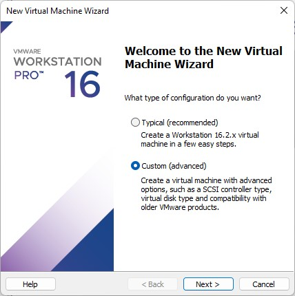

* 虚拟机兼容性选当前 VMWare Workstation 支持最新版，比如 16.2.x

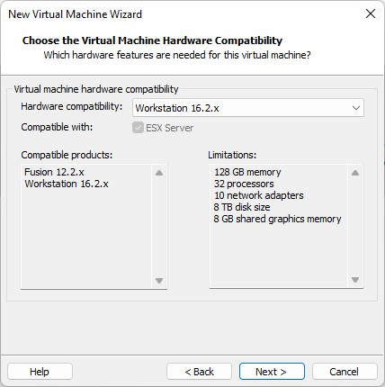

* 选择稍后安装操作系统

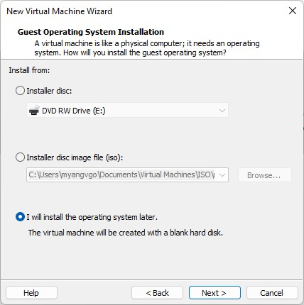

* 选择 Linux --> Red Hat Enterprise Linux 8 64-bit

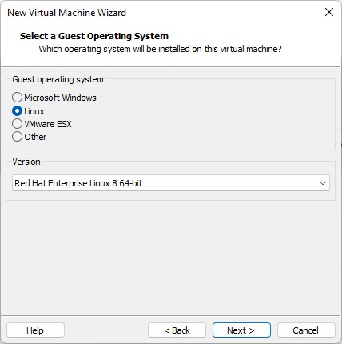

* 设置虚拟机名称和位置，比如 RHCE

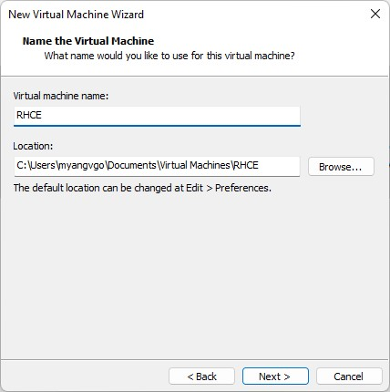

* 设置 CPU

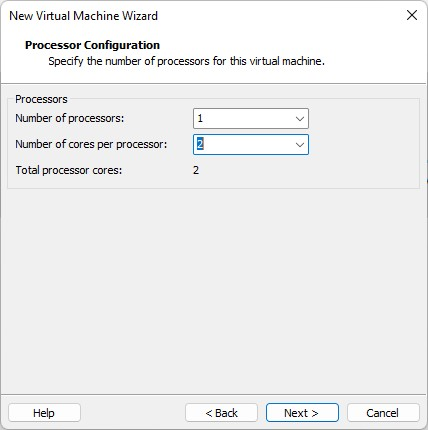

* 设置内存，建议最小为 2G

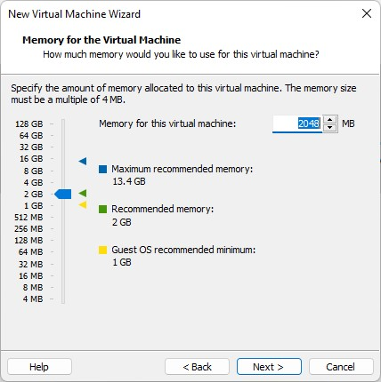

* 网络类型选择 NAT

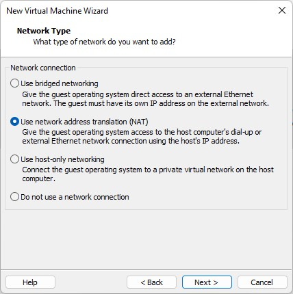

* SCSI 控制器类型选择 LSI Logic

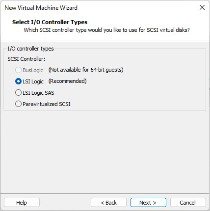

* 磁盘类型选择常用的 SCSI 接口类型

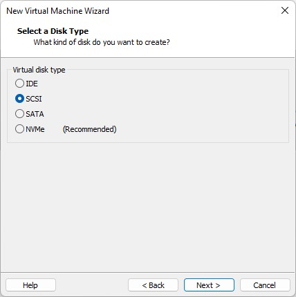

* 创建新虚拟硬盘

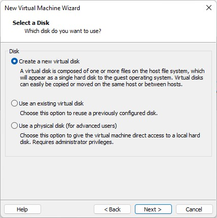

* 设置硬盘容量

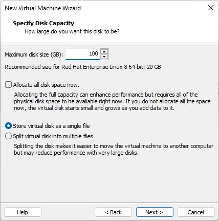

* 设置磁盘名称

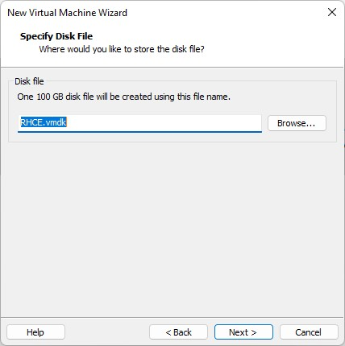

* 选择自定义硬件

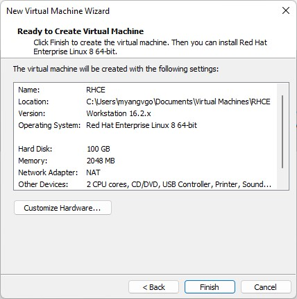

* 移除打印机、声卡、USB 控制器。选择 CD/DVD 选项，浏览本地镜像文件（需要提前下载好）

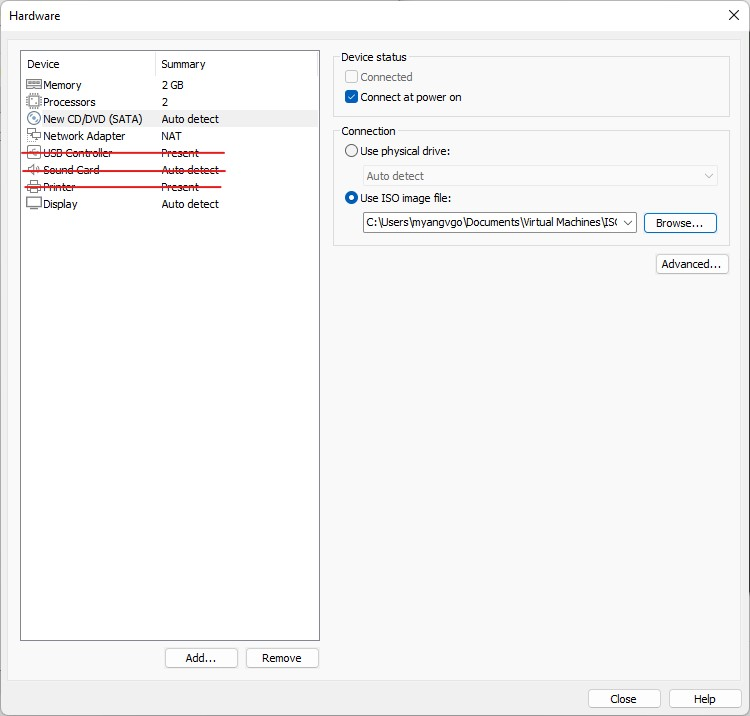

* 点击完成虚拟硬件的配置

## 2. 安装 Linux 系统

* 在虚拟机管理界面中单击**开启此虚拟机**，选择 Install Red Hat Enterprise Linux 8.4

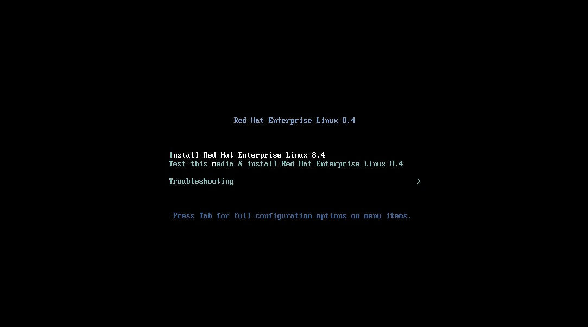

* 选择安装过程使用的语言，这里选择简体中文

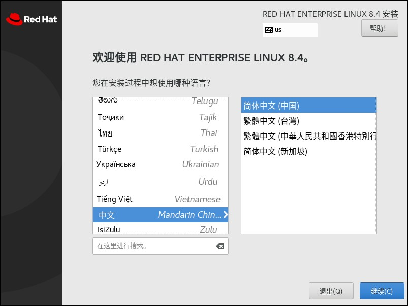

* 点击继续进入到安装信息摘要

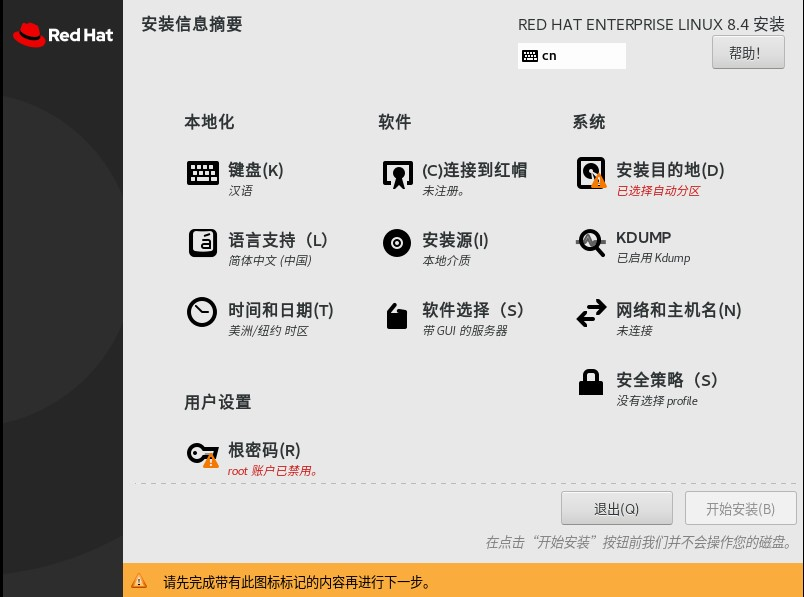

* 点击**时间和日期**，选择中国境内的上海时间，调整为当前的日期和时间
* **软件选择**为默认的带GUI的服务器
* 网络和主机名配置信息
  * 主机名改为：server.rhce.net 并应用修改
  * 将网卡设置为打开状态：此时会自动连接
  * 在配置-->常规里面，勾选自动以优先级连接

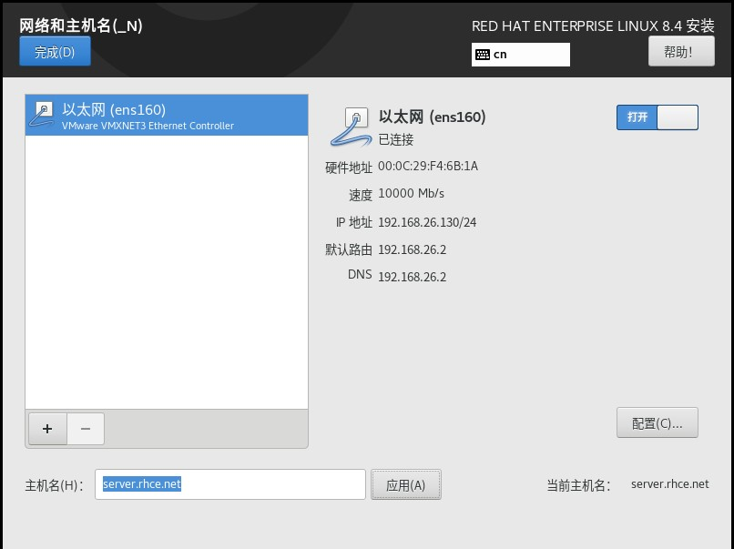

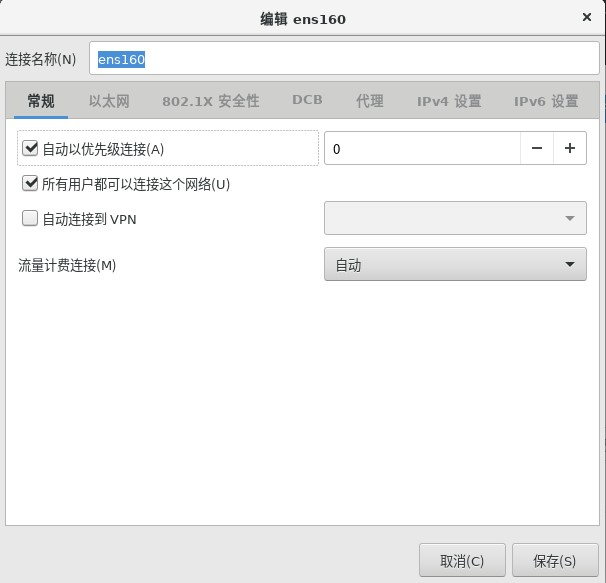

* 点击设置管理员密码 root password，这里设置为 `redhat`
* 点击用户设置-->创建用户，创建普通用户：sadmin 密码为 `redhat`

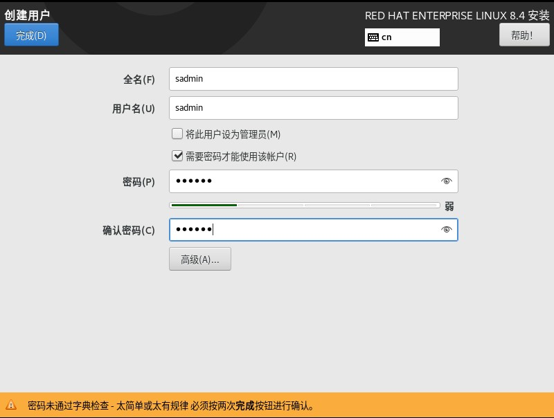

* 设置安装路径，选择自定义安装来手动分区；也可以选择自动分区

  * 选择标准分区

  > Linux 中硬盘的命名
  >
  > * IDE：第一块硬盘叫做 hda，硬盘上的分区依次为 hda1, hda2... 第二块硬盘叫做 hdb，硬盘上的分区依次为 hdb1, hdb2...
  > * SATA/SCSI：第一块硬盘叫做 sda，硬盘上的分区依次为 sda1, sda2... 第二块硬盘叫做 sdb，硬盘上的分区依次为 sdb1, sdb2...
  >
  > 挂载：将某个分区装在文件夹的过程
  >
  > 挂载点：被装载的文件夹

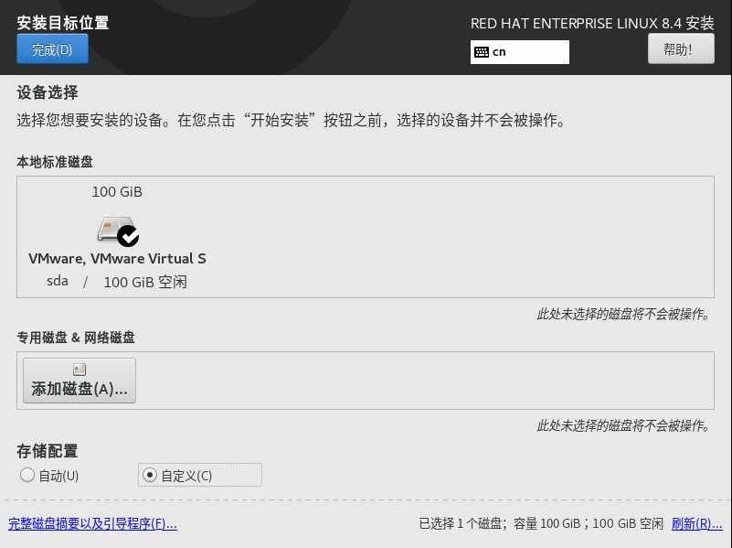

* 设置分区
  * 添加根目录挂载点，分区大小为60G
  * 添加 `/home` 挂载点，分区大小为10G
  * 添加 `swap` 挂载点，分区大小为 2G
  * 点击完成，并接受更改

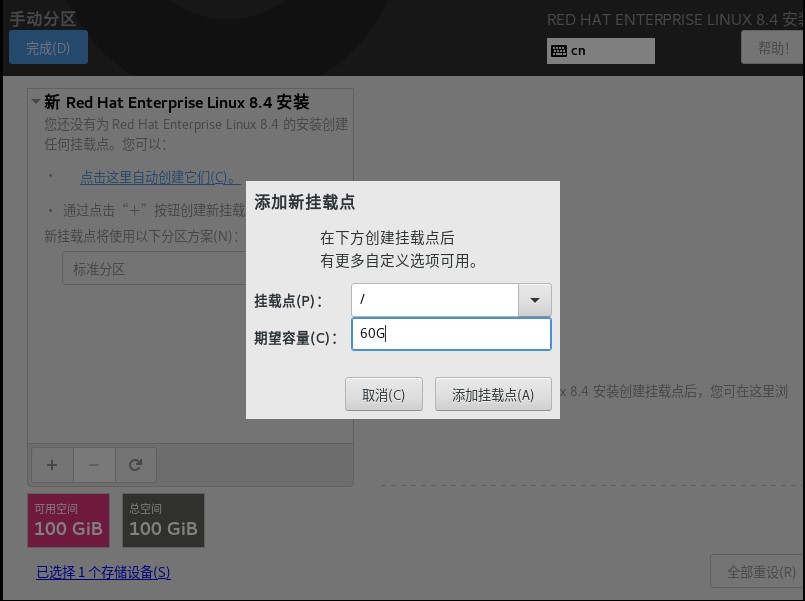

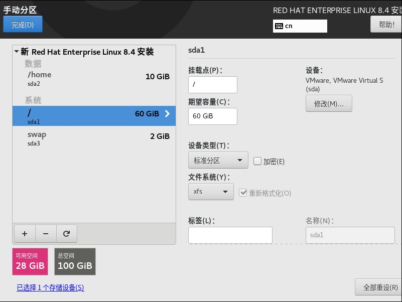

所有配置完成后，点击开始安装，然后等待重启。

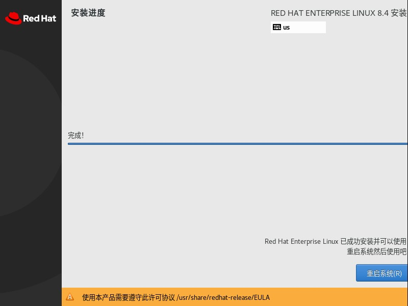

[返回](../README.md)