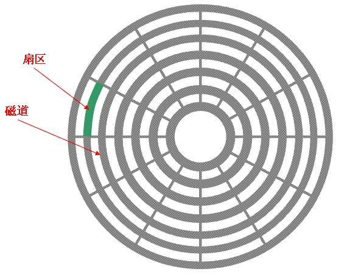

# Chapter 06 分区管理

[返回](../)

- [1. 分区的概念](#1-分区的概念)
  - [分区的类别](#分区的类别)
  - [分区方案](#分区方案)
    - [MBR分区方案](#mbr分区方案)
    - [GPT分区方案](#gpt分区方案)
- [2. 管理磁盘分区](#2-管理磁盘分区)
  - [虚拟机增加硬盘](#虚拟机增加硬盘)
  - [lsblk](#lsblk)
  - [fdisk](#fdisk)
    - [创建扩展分区和逻辑分区](#创建扩展分区和逻辑分区)
    - [查看分区类型](#查看分区类型)
    - [更改分区类型](#更改分区类型)
    - [保存分区更改](#保存分区更改)
    - [partprobe 重读分区表信息](#partprobe-重读分区表信息)
  - [parted 磁盘分区工具](#parted-磁盘分区工具)
  - [创建文件系统](#创建文件系统)
    - [查看文件系统的ID](#查看文件系统的id)
  - [挂载分区](#挂载分区)
    - [持久挂载文件系统（自动挂载）](#持久挂载文件系统自动挂载)
- [3. swap 分区](#3-swap-分区)
  - [查看 swap 分区](#查看-swap-分区)
  - [设置 swap 分区并激活](#设置-swap-分区并激活)
  - [关闭 swap 分区](#关闭-swap-分区)
  - [设置开机自动挂载 swap 分区](#设置开机自动挂载-swap-分区)


## 1. 分区的概念

磁盘分区允许系统管理员将硬盘划分为多个逻辑存储单元，这些单元称为分区（Partition）。

- 磁道：当磁盘旋转时，磁头若保持在一个位置上，则每个磁头都会在磁盘表面划出一个原型轨迹，叫做磁道（Track）
- 扇区：磁盘上的每个磁道被划分为若干弧段，这些弧段称为磁盘的扇区（Sector），每个扇区可以存放 512 Byte 信息。**扇区是划分分区的最小单位**。




### 分区的类别

**主分区**：直接从硬盘上划分，并且可以直接格式化使用的分区。

**扩展分区**：直接从硬盘上划分，但是不是直接使用的分区。创建好一个扩展分区，就不能再创建第二个扩展分区。

**逻辑分区**：在扩展分区上划分的分区。如果没有扩展分区的话，就不能创建逻辑分区。

### 分区方案

#### MBR分区方案

主启动记录 MBR 分区方案指定了在运行 **BIOS** 固件系统上如何对硬盘进行分区。

* 第一个扇区为 MBR 扇区，占512字节，包含主引导代码Boot Loader（446字节）、磁盘分区表（DPT，64字节）以及标记扇区结束的引导签名（2字节）
* 最多支持四个主分区
* 分区数据以32位存储，最大磁盘和分区大小为 2T


#### GPT分区方案

GPT（GUID Partition Table）分区方案是较新的标准，属于UEFI统一可扩展固件接口系统标准的一部分。

- 使用 GUID 来标识每个磁盘和分区
- 第一个扇区也是 MBR 扇区，提供了分区表信息冗余
- GPT为逻辑块地址分配64位空间，能支持最大 8 ZiB 的分区和磁盘


## 2. 管理磁盘分区

### 虚拟机增加硬盘


### lsblk

list block devices

```sh
# 查看系统的磁盘使用情况
[root@server130 ~]# lsblk
NAME   MAJ:MIN RM  SIZE RO TYPE MOUNTPOINT
sda      8:0    0  100G  0 disk
├─sda1   8:1    0   60G  0 part /
├─sda2   8:2    0   10G  0 part /home
└─sda3   8:3    0    2G  0 part [SWAP]
sdb      8:16   0   20G  0 disk
sr0     11:0    1  9.4G  0 rom
```

### fdisk

`fdisk` 命令用于管理磁盘的分区信息。它是针对于 MBR 格式的分区。对于 GPT 格式的分区，使用 `gdisk` 命令。

`fdisk [参数] [设备名]`

常用的命令有

- `p` 打印分区表
- `n` 添加一个分区
- `d` 删除一个分区
- `l` 列出分区类型
- `t` 转发分区的类型
- `q` 不保存直接退出
- `w` 保存退出

**查看磁盘分区**

```sh
# 1. 查看系统中所有磁盘的分区信息
[root@server130 ~]# fdisk -l
Disk /dev/sda：100 GiB，107374182400 字节，209715200 个扇区
单元：扇区 / 1 * 512 = 512 字节
扇区大小(逻辑/物理)：512 字节 / 512 字节
I/O 大小(最小/最佳)：512 字节 / 512 字节
磁盘标签类型：dos
磁盘标识符：0x15001e88

设备       启动      起点      末尾      扇区 大小 Id 类型
/dev/sda1  *         2048 125831167 125829120  60G 83 Linux
/dev/sda2       125831168 146802687  20971520  10G 83 Linux
/dev/sda3       146802688 150996991   4194304   2G 82 Linux swap / Solaris


Disk /dev/sdb：20 GiB，21474836480 字节，41943040 个扇区
单元：扇区 / 1 * 512 = 512 字节
扇区大小(逻辑/物理)：512 字节 / 512 字节
I/O 大小(最小/最佳)：512 字节 / 512 字节

# 2. 查看系统中指定磁盘的分区信息
fdisk -l /dev/sda
```

**创建主分区**

```sh
# 对磁盘 /dev/sdb 进行分区
fdisk /dev/sdb

[root@server130 ~]# fdisk /dev/sdb

欢迎使用 fdisk (util-linux 2.32.1)。
更改将停留在内存中，直到您决定将更改写入磁盘。
使用写入命令前请三思。

设备不包含可识别的分区表。
创建了一个磁盘标识符为 0x06bb82c8 的新 DOS 磁盘标签。

命令(输入 m 获取帮助)：n
分区类型
   p   主分区 (0个主分区，0个扩展分区，4空闲)
   e   扩展分区 (逻辑分区容器)
选择 (默认 p)：p
分区号 (1-4, 默认  1):
第一个扇区 (2048-41943039, 默认 2048):
上个扇区，+sectors 或 +size{K,M,G,T,P} (2048-41943039, 默认 41943039): +2G

创建了一个新分区 1，类型为“Linux”，大小为 2 GiB。

命令(输入 m 获取帮助)：p
Disk /dev/sdb：20 GiB，21474836480 字节，41943040 个扇区
单元：扇区 / 1 * 512 = 512 字节
扇区大小(逻辑/物理)：512 字节 / 512 字节
I/O 大小(最小/最佳)：512 字节 / 512 字节
磁盘标签类型：dos
磁盘标识符：0x06bb82c8

设备       启动  起点    末尾    扇区 大小 Id 类型
/dev/sdb1        2048 4196351 4194304   2G 83 Linux

命令(输入 m 获取帮助)：
```

#### 创建扩展分区和逻辑分区

```sh
命令(输入 m 获取帮助)：n
分区类型
   p   主分区 (2个主分区，0个扩展分区，2空闲)
   e   扩展分区 (逻辑分区容器)
选择 (默认 p)：e
分区号 (3,4, 默认  3):
第一个扇区 (8390656-41943039, 默认 8390656):
上个扇区，+sectors 或 +size{K,M,G,T,P} (8390656-41943039, 默认 41943039):

创建了一个新分区 3，类型为“Extended”，大小为 16 GiB。

命令(输入 m 获取帮助)：p
Disk /dev/sdb：20 GiB，21474836480 字节，41943040 个扇区
单元：扇区 / 1 * 512 = 512 字节
扇区大小(逻辑/物理)：512 字节 / 512 字节
I/O 大小(最小/最佳)：512 字节 / 512 字节
磁盘标签类型：dos
磁盘标识符：0x06bb82c8

设备       启动    起点     末尾     扇区 大小 Id 类型
/dev/sdb1          2048  4196351  4194304   2G 83 Linux
/dev/sdb2       4196352  8390655  4194304   2G 83 Linux
/dev/sdb3       8390656 41943039 33552384  16G  5 扩展

命令(输入 m 获取帮助)：n
所有主分区的空间都在使用中。
添加逻辑分区 5
第一个扇区 (8392704-41943039, 默认 8392704):
上个扇区，+sectors 或 +size{K,M,G,T,P} (8392704-41943039, 默认 41943039): +2G

创建了一个新分区 5，类型为“Linux”，大小为 2 GiB。

命令(输入 m 获取帮助)：p
Disk /dev/sdb：20 GiB，21474836480 字节，41943040 个扇区
单元：扇区 / 1 * 512 = 512 字节
扇区大小(逻辑/物理)：512 字节 / 512 字节
I/O 大小(最小/最佳)：512 字节 / 512 字节
磁盘标签类型：dos
磁盘标识符：0x06bb82c8

设备       启动     起点     末尾     扇区 大小 Id 类型
/dev/sdb1           2048  4196351  4194304   2G 83 Linux
/dev/sdb2        4196352  8390655  4194304   2G 83 Linux
/dev/sdb3        8390656 41943039 33552384  16G  5 扩展
/dev/sdb5        8392704 12587007  4194304   2G 83 Linux
/dev/sdb6       12589056 16783359  4194304   2G 83 Linux
/dev/sdb7       16785408 20979711  4194304   2G 83 Linux
/dev/sdb8       20981760 25176063  4194304   2G 83 Linux

命令(输入 m 获取帮助)：
```

#### 查看分区类型

`fdisk` 下 `l` 命令列出了分区类型和对应的 Id

```sh
命令(输入 m 获取帮助)：l

 0  空              24  NEC DOS         81  Minix / 旧 Linu bf  Solaris
 1  FAT12           27  隐藏的 NTFS Win 82  Linux swap / So c1  DRDOS/sec (FAT-
 2  XENIX root      39  Plan 9          83  Linux           c4  DRDOS/sec (FAT-
 3  XENIX usr       3c  PartitionMagic  84  OS/2 隐藏 或 In c6  DRDOS/sec (FAT-
 4  FAT16 <32M      40  Venix 80286     85  Linux 扩展      c7  Syrinx
 5  扩展            41  PPC PReP Boot   86  NTFS 卷集       da  非文件系统数据
 6  FAT16           42  SFS             87  NTFS 卷集       db  CP/M / CTOS / .
 7  HPFS/NTFS/exFAT 4d  QNX4.x          88  Linux 纯文本    de  Dell 工具
 8  AIX             4e  QNX4.x 第2部分  8e  Linux LVM       df  BootIt
 9  AIX 可启动      4f  QNX4.x 第3部分  93  Amoeba          e1  DOS 访问
 a  OS/2 启动管理器 50  OnTrack DM      94  Amoeba BBT      e3  DOS R/O
 b  W95 FAT32       51  OnTrack DM6 Aux 9f  BSD/OS          e4  SpeedStor
 c  W95 FAT32 (LBA) 52  CP/M            a0  IBM Thinkpad 休 ea  Rufus 对齐
 e  W95 FAT16 (LBA) 53  OnTrack DM6 Aux a5  FreeBSD         eb  BeOS fs
 f  W95 扩展 (LBA)  54  OnTrackDM6      a6  OpenBSD         ee  GPT
10  OPUS            55  EZ-Drive        a7  NeXTSTEP        ef  EFI (FAT-12/16/
11  隐藏的 FAT12    56  Golden Bow      a8  Darwin UFS      f0  Linux/PA-RISC
12  Compaq 诊断     5c  Priam Edisk     a9  NetBSD          f1  SpeedStor
14  隐藏的 FAT16 <3 61  SpeedStor       ab  Darwin 启动     f4  SpeedStor
16  隐藏的 FAT16    63  GNU HURD 或 Sys af  HFS / HFS+      f2  DOS 次要
17  隐藏的 HPFS/NTF 64  Novell Netware  b7  BSDI fs         fb  VMware VMFS
18  AST 智能睡眠    65  Novell Netware  b8  BSDI swap       fc  VMware VMKCORE
1b  隐藏的 W95 FAT3 70  DiskSecure 多启 bb  Boot Wizard 隐  fd  Linux raid 自动
1c  隐藏的 W95 FAT3 75  PC/IX           bc  Acronis FAT32 L fe  LANstep
1e  隐藏的 W95 FAT1 80  旧 Minix        be  Solaris 启动    ff  BBT
```

#### 更改分区类型

```sh
# 将主分区 2 改为 swap 分区类型

命令(输入 m 获取帮助)：t
分区号 (1-3,5-8, 默认  8): 2
Hex 代码(输入 L 列出所有代码)：82

已将分区“Linux”的类型更改为“Linux swap / Solaris”。

# 将逻辑分区的类型改为 LVM
命令(输入 m 获取帮助)：t
分区号 (1-3,5-8, 默认  8): 5
Hex 代码(输入 L 列出所有代码)：8e

已将分区“Linux”的类型更改为“Linux LVM”。
```

#### 保存分区更改

```sh
命令(输入 m 获取帮助)：w
分区表已调整。
将调用 ioctl() 来重新读分区表。
正在同步磁盘。
```

#### partprobe 重读分区表信息

`partprobe` (partition probe) 命令用于重读分区表信息。**将磁盘分区表变化信息通知给系统内核**，请求操作系统重新加载分区表，可以在不重启系统的情况下重读分区表信息，使得新设备信息被同步。

```sh
[root@server130 ~]# partprobe /dev/sdb
```

### parted 磁盘分区工具

借助 parted 分区编辑器程序，管理员可以对磁盘的分区进行更改。与 fdisk 命令不同的是，parted 命令可以调整分区的大小，可以处理常见的分区格式。

`parted` 命令更改会立即生效。

`parted [参数] [设备名]`

```sh
# 将硬盘格式化为 MBR 格式
parted -s /dev/sdb mklabel msdos

# 将硬盘格式化为 GPT 格式
parted -s /dev/sdb mklabel gpt

# 将硬盘格式化 但不指定格式
parted -s /dev/sdb mklabel gpt

# 显示分区表
[root@server130 ~]# parted /dev/sdb print

# 创建分区表
parted -s /dev/硬盘 mkpart 分区类型 文件系统 起始大小m 最终大小N
```

### 创建文件系统

在创建完块设备后，下一步需要向其中添加文件系统。常见的两种文件类型是：XFS 和 ext4

```sh
[root@server130 ~]# mkfs.xfs /dev/sdb1
meta-data=/dev/sdb1              isize=512    agcount=4, agsize=131072 blks
         =                       sectsz=512   attr=2, projid32bit=1
         =                       crc=1        finobt=1, sparse=1, rmapbt=0
         =                       reflink=1
data     =                       bsize=4096   blocks=524288, imaxpct=25
         =                       sunit=0      swidth=0 blks
naming   =version 2              bsize=4096   ascii-ci=0, ftype=1
log      =internal log           bsize=4096   blocks=2560, version=2
         =                       sectsz=512   sunit=0 blks, lazy-count=1
realtime =none                   extsz=4096   blocks=0, rtextents=0

# 查看格式化分区信息
[root@server130 ~]# xfs_info /dev/sdb1
meta-data=/dev/sdb1              isize=512    agcount=4, agsize=131072 blks
         =                       sectsz=512   attr=2, projid32bit=1
         =                       crc=1        finobt=1, sparse=1, rmapbt=0
         =                       reflink=1
data     =                       bsize=4096   blocks=524288, imaxpct=25
         =                       sunit=0      swidth=0 blks
naming   =version 2              bsize=4096   ascii-ci=0, ftype=1
log      =internal log           bsize=4096   blocks=2560, version=2
         =                       sectsz=512   sunit=0 blks, lazy-count=1
realtime =none                   extsz=4096   blocks=0, rtextents=0
```

#### 查看文件系统的ID

```sh
# 显示块设备的信息
[root@server130 ~]# blkid
/dev/sdb1: UUID="be43746c-3777-4523-9c81-8674b27523c4" BLOCK_SIZE="512" TYPE="xfs" PARTUUID="06bb82c8-01"
/dev/sdb2: PARTUUID="06bb82c8-02"
/dev/sdb5: PARTUUID="06bb82c8-05"
/dev/sdb6: PARTUUID="06bb82c8-06"
/dev/sdb7: PARTUUID="06bb82c8-07"
/dev/sdb8: PARTUUID="06bb82c8-08"
/dev/sda1: UUID="6fa21258-dc7c-44d1-8e4e-42f695cdfa09" BLOCK_SIZE="512" TYPE="xfs" PARTUUID="15001e88-01"
/dev/sda2: UUID="344525e7-248f-49ff-bd91-2828e0b4bee6" BLOCK_SIZE="512" TYPE="xfs" PARTUUID="15001e88-02"
/dev/sda3: UUID="159f3274-78ce-4f49-90c9-979a5981b773" TYPE="swap" PARTUUID="15001e88-03"
/dev/sr0: BLOCK_SIZE="2048" UUID="2021-05-03-15-21-56-00" LABEL="RHEL-8-4-0-BaseOS-x86_64" TYPE="iso9660" PTUUID="426eea3b" PTTYPE="dos"


# 查询指定分区的信息
[root@server130 ~]# xfs_admin -u /dev/sdb1
UUID = be43746c-3777-4523-9c81-8674b27523c4

# 使用指定的UUID
[root@server130 ~]# uuidgen
6890fe16-0777-45d4-878e-81979216d5f6
[root@server130 ~]# xfs_admin -U 6890fe16-0777-45d4-878e-81979216d5f6 /dev/sdb1
Clearing log and setting UUID
writing all SBs
new UUID = 6890fe16-0777-45d4-878e-81979216d5f6
```

### 挂载分区

添加完文件系统之后，最后是将文件系统挂载到目录结构中的目录上。

```sh
# 普通挂载和卸载
[root@server130 ~]# mkdir /xyz
[root@server130 ~]# mount /dev/sdb1 /xyz
[root@server130 ~]# umount /xyz

# UUID 挂载和卸载 (可以避免系统挂载磁盘篡位问题)
[root@server130 ~]# mount UUID=be43746c-3777-4523-9c81-8674b27523c4 /xyz
[root@server130 ~]# df -hT | grep xyz
/dev/sdb1      xfs       2.0G   47M  2.0G    3% /xyz
```

#### 持久挂载文件系统（自动挂载）

手动挂载文件系统，在系统重启后，系统不会再次将文件系统自动挂载到目录树上。

为了确保系统在启动时自动挂载文件系统，需要在 `/etc/fstab` 中添加条目

```sh
vi /etc/fstab
```

## 3. swap 分区

swap 空间是受 Linux 内核内存管理子系统所控制的磁盘区域。通过保存不活动的内存页来补充系统 RAM。系统 RAM 和 Swap 空间一起称为虚拟内存。

物理内存使用率达到了一定的百分比之后，就开始使用swap。

真正能分配出去的内存 `CommitLimt=物理内存*overcommit_ratio + swap分区`

```sh
# 内存相关参数的配置
[root@server130 ~]# ls /proc/sys/vm/
admin_reserve_kbytes         dirtytime_expire_seconds   memory_failure_recovery  numa_stat                 stat_interval
block_dump                   dirty_writeback_centisecs  min_free_kbytes          numa_zonelist_order       stat_refresh
compaction_proactiveness     drop_caches                min_slab_ratio           oom_dump_tasks            swappiness

# 物理内存的使用率达到了 (100 - 30)% 开始使用 swap
[root@server130 ~]# cat /proc/sys/vm/swappiness
30
```

### 查看 swap 分区

```sh
[root@server130 ~]# cat /proc/swaps
Filename                                Type            Size    Used    Priority
/dev/sda3                               partition       2097148 0       -2
[root@server130 ~]# swapon -s
文件名                          类型            大小    已用    权限
/dev/sda3                               partition       2097148 0       -2
```

### 设置 swap 分区并激活

`mkswap` 向设备应用交换签名，它在设备开头写入单个数据块，而将设备的其余部分保留为未格式化。

```sh
[root@server130 ~]# mkswap /dev/sdb2
正在设置交换空间版本 1，大小 = 2 GiB (2147479552  个字节)
无标签，UUID=2d1fcbe8-131e-45c1-b193-e28c82f04d1c

[root@server130 ~]# swapon /dev/sdb2
[root@server130 ~]# swapon -s
文件名                          类型            大小    已用    权限
/dev/sda3                               partition       2097148 0       -2
/dev/sdb2                               partition       2097148 0       -3

# 指定优先级，数值越大，优先级越高，优先启用
[root@server130 ~]# swapon -p 1 /dev/sdb2
[root@server130 ~]# swapon -s
文件名                          类型            大小    已用    权限
/dev/sda3                               partition       2097148 0       -2
/dev/sdb2                               partition       2097148 0       1
```

### 关闭 swap 分区

```sh
[root@server130 ~]# swapoff /dev/sdb2
```

### 设置开机自动挂载 swap 分区

```sh
#
# /etc/fstab
# Created by anaconda on Tue Oct 18 15:13:27 2022
#
# Accessible filesystems, by reference, are maintained under '/dev/disk/'.
# See man pages fstab(5), findfs(8), mount(8) and/or blkid(8) for more info.
#
# After editing this file, run 'systemctl daemon-reload' to update systemd
# units generated from this file.
#
UUID=6fa21258-dc7c-44d1-8e4e-42f695cdfa09 /                       xfs     defaults        0 0
UUID=344525e7-248f-49ff-bd91-2828e0b4bee6 /home                   xfs     defaults        0 0
UUID=159f3274-78ce-4f49-90c9-979a5981b773 none                    swap    defaults        0 0
/dev/sdb2       swap                    swap                    defaults,pri=2            0 0
```