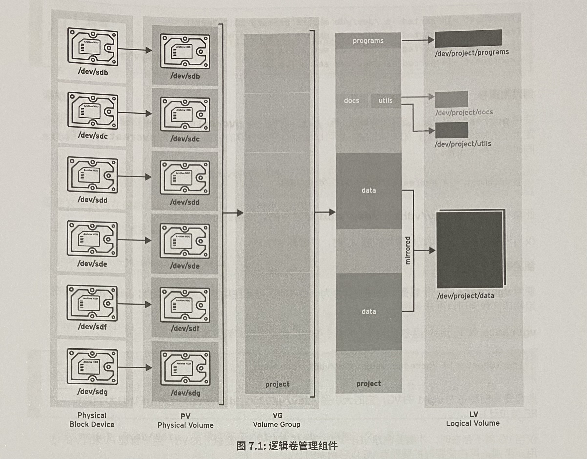

# Chapter 07 逻辑卷

[返回](../)

- [1. 逻辑卷的介绍](#1-逻辑卷的介绍)
  - [LVM 概念](#lvm-概念)
    - [物理设备](#物理设备)
    - [物理卷 PV (Physical Volume)](#物理卷-pv-physical-volume)
    - [卷组 VG (Volume Group)](#卷组-vg-volume-group)
    - [逻辑卷 LV (Logical Volume)](#逻辑卷-lv-logical-volume)
  - [实施 LVM 存储的流程](#实施-lvm-存储的流程)
- [2. 逻辑卷的管理](#2-逻辑卷的管理)
  - [2.1 PV 管理](#21-pv-管理)
  - [2.2 VG 管理](#22-vg-管理)
  - [2.3 LV 管理](#23-lv-管理)
- [3. 扩展和缩减逻辑卷](#3-扩展和缩减逻辑卷)
  - [扩展逻辑卷](#扩展逻辑卷)
    - [`lvextend` 扩展逻辑卷](#lvextend-扩展逻辑卷)
    - [扩展文件系统](#扩展文件系统)
    - [同时扩展逻辑卷和文件系统](#同时扩展逻辑卷和文件系统)
  - [缩减逻辑卷](#缩减逻辑卷)
    - [卸载文件系统](#卸载文件系统)
    - [对文件系统进行检查](#对文件系统进行检查)
    - [缩小文件系统](#缩小文件系统)
    - [缩小逻辑卷](#缩小逻辑卷)
    - [重新挂载逻辑卷](#重新挂载逻辑卷)
- [4. 逻辑卷快照](#4-逻辑卷快照)

## 1. 逻辑卷的介绍

逻辑卷最大的特点是空间可变。如果逻辑卷的文件系统需要更多的存储空间，可以将卷组中的可用空间分配给逻辑卷，并且可以调整文件系统的大小。

### LVM 概念

#### 物理设备

物理设备是用于保存逻辑卷中所存储数据的存储设备，比如块设备、磁盘分区、整个磁盘、RAID 或者 SAN。

#### 物理卷 PV (Physical Volume)

在 LVM 系统中，设备必须被初始化为 LVM 物理卷，才能和LVM结合使用。整个设备将用作一个物理卷。

LVM 工具会将 PV 划分为物理区块 PE（Physical Extent），它是 PV 中用于分配的最小存储单元。PE 物理区块大小在建立卷组时指定，一旦确定不能更改。

#### 卷组 VG (Volume Group)

卷组是存储池，由一个或多个物理卷组成。在功能上与整个磁盘相当。

一个 PV 只能分配给一个 VG。

VG 可以包含未使用的空间和任意数目的逻辑卷。

#### 逻辑卷 LV (Logical Volume)

逻辑卷根据卷组中的空闲物理区块创建。

LV 是逻辑区块 LE （Logical Extent） 的集合，LE 映射到了 PE。LE 是逻辑卷中可用于分配的最小存储单元。

默认情况下，每个 LE 映射到一个 PE。

### 实施 LVM 存储的流程



## 2. 逻辑卷的管理

### 2.1 PV 管理

`pvcreate` 创建物理卷

```sh
# 将设备标记为 PV
[root@server130 ~]# pvcreate /dev/sdb{5..8}
  Physical volume "/dev/sdb5" successfully created.
  Physical volume "/dev/sdb6" successfully created.
  Physical volume "/dev/sdb7" successfully created.
  Physical volume "/dev/sdb8" successfully created.
```

`pvs` 或者 `pvscan` 或者 `pvdisplay` 查看物理卷

```sh
[root@server130 ~]# pvscan
  PV /dev/sdb5                      lvm2 [2.00 GiB]
  PV /dev/sdb6                      lvm2 [2.00 GiB]
  PV /dev/sdb7                      lvm2 [2.00 GiB]
  PV /dev/sdb8                      lvm2 [2.00 GiB]
  Total: 4 [8.00 GiB] / in use: 0 [0   ] / in no VG: 4 [8.00 GiB]
[root@server130 ~]# pvs
  PV         VG Fmt  Attr PSize PFree
  /dev/sdb5     lvm2 ---  2.00g 2.00g
  /dev/sdb6     lvm2 ---  2.00g 2.00g
  /dev/sdb7     lvm2 ---  2.00g 2.00g
  /dev/sdb8     lvm2 ---  2.00g 2.00g
[root@server130 ~]# pvdisplay /dev/sdb5
  --- Physical volume ---
  PV Name               /dev/sdb5
  VG Name               vg0
  PV Size               2.00 GiB / not usable 4.00 MiB
  Allocatable           yes
  PE Size               4.00 MiB
  Total PE              511
  Free PE               381
  Allocated PE          130
  PV UUID               OfVSSr-iAFu-qdWv-Uj42-cYWP-qB9j-HrFfKu
```

`pvremove` 删除物理卷

```sh
[root@server130 ~]# pvremove /dev/sdb{5..8}
  Labels on physical volume "/dev/sdb5" successfully wiped.
  Labels on physical volume "/dev/sdb6" successfully wiped.
  Labels on physical volume "/dev/sdb7" successfully wiped.
  Labels on physical volume "/dev/sdb8" successfully wiped.
[root@server130 ~]# pvs
[root@server130 ~]# pvscan
  No matching physical volumes found
```

### 2.2 VG 管理

`vgcreate` 创建卷组 -- 将一个或多个物理卷组成一个卷组。

卷组在功能上与硬盘相当。

```sh
# 按照默认大小（PE=4MiB）创建
[root@server130 ~]# vgcreate vg0 /dev/sdb{5..8}
  Volume group "vg0" successfully created

# 按照指定大小创建 PE Size = 8MiB
[root@server130 ~]# vgcreate -s 8 vg0 /dev/sdb{5..8}
  Volume group "vg0" successfully created
```

`vgs` 或者 `vgscan`  查看卷组

```sh
[root@server130 ~]# vgs
  VG  #PV #LV #SN Attr   VSize VFree
  vg0   4   0   0 wz--n- 7.98g 7.98g
[root@server130 ~]# vgscan
  Found volume group "vg0" using metadata type lvm2
```

`vgreduce` 减少卷组的大小

```sh
[root@server130 ~]# vgreduce vg0 /dev/sdb8
  Removed "/dev/sdb8" from volume group "vg0"
[root@server130 ~]# vgs
  VG  #PV #LV #SN Attr   VSize  VFree
  vg0   3   0   0 wz--n- <5.99g <5.99g
```

`vgextend` 增加或者扩展卷组的大小

可以通过添加额外的物理卷来为**卷组**增加额外的空间。可以从额外的物理卷中为逻辑卷分配新的物理区块。

```sh
[root@server130 ~]# vgextend vg0 /dev/sdb8
  Volume group "vg0" successfully extended
[root@server130 ~]# vgs
  VG  #PV #LV #SN Attr   VSize VFree
  vg0   4   0   0 wz--n- 7.98g 7.98g
```

`vgdisplay` 查看卷组的详细信息

```sh
[root@server130 ~]# vgdisplay vg0
  --- Volume group ---
  VG Name               vg0
  System ID
  Format                lvm2
  Metadata Areas        4
  Metadata Sequence No  3
  VG Access             read/write
  VG Status             resizable
  MAX LV                0
  Cur LV                0
  Open LV               0
  Max PV                0
  Cur PV                4
  Act PV                4
  VG Size               7.98 GiB
  PE Size               4.00 MiB
  Total PE              2044
  Alloc PE / Size       0 / 0
  Free  PE / Size       2044 / 7.98 GiB
  VG UUID               fwtrXc-Sqy8-saI9-SoQO-Q9dJ-WGIW-vDLqGL

```

`vgremove` 删除卷组

未使用的物理卷可以从卷组中删除。

```sh
[root@server130 ~]# vgremove vg0
  Volume group "vg0" successfully removed
```

`vgrename` 重命名

```sh
[root@server130 ~]# vgrename vg0 myvg
  Volume group "vg0" successfully renamed to "myvg"
```

### 2.3 LV 管理

`lvcreate` 创建逻辑卷

```sh
lvcreate -L Size -n Name vgname
lvcreate -l PENumber -n Name vgname
lvcreate -l 数值%free -n Name vgname

[root@server130 ~]# lvcreate -L 98M -n lv0 vg0
  Rounding up size to full physical extent 100.00 MiB
  Logical volume "lv0" created.
[root@server130 ~]# lvcreate -L 100M -n lv1 vg0
  Logical volume "lv1" created.
[root@server130 ~]# lvcreate -l 25 -n lv2 vg0
  Logical volume "lv2" created.

# 使用剩余空间的 10%
[root@server130 ~]# lvcreate -l 10%free -n lv3 vg0
  Logical volume "lv3" created.

# 使用剩余空间的 100%
[root@server130 ~]# lvcreate -l 100%free -n lv4 vg0
  Logical volume "lv4" created.

```

`lvscan` 或者 `lvs` `lvdisplay` 查看逻辑卷

```sh
[root@server130 ~]# lvscan
  ACTIVE            '/dev/vg0/lv0' [100.00 MiB] inherit
  ACTIVE            '/dev/vg0/lv1' [100.00 MiB] inherit
  ACTIVE            '/dev/vg0/lv2' [100.00 MiB] inherit
  ACTIVE            '/dev/vg0/lv3' [784.00 MiB] inherit
  ACTIVE            '/dev/vg0/lv4' [<6.93 GiB] inherit

[root@server130 ~]# lvdisplay /dev/vg0/lv0
  --- Logical volume ---
  LV Path                /dev/vg0/lv0
  LV Name                lv0
  VG Name                vg0
  LV UUID                jio4HW-MtGX-EHWg-Jyae-hdAU-NIJG-lRVHpQ
  LV Write Access        read/write
  LV Creation host, time server130.rhce.net, 2023-11-09 19:47:54 +0800
  LV Status              available
  # open                 1
  LV Size                400.00 MiB
  Current LE             100
  Segments               3
  Allocation             inherit
  Read ahead sectors     auto
  - currently set to     8192
  Block device           253:0
```

`lvremove` 删除逻辑卷

```sh
[root@server130 ~]# lvremove /dev/vg0/lv4
Do you really want to remove active logical volume vg0/lv4? [y/n]: y
  Logical volume "lv4" successfully removed

# 强制删除
[root@server130 ~]# lvremove /dev/vg0/lv3 -f
  Logical volume "lv3" successfully removed

```

`mkfs` 添加文件系统

```sh
[root@server130 ~]# mkfs.xfs /dev/vg0/lv0
meta-data=/dev/vg0/lv0           isize=512    agcount=4, agsize=6400 blks
         =                       sectsz=512   attr=2, projid32bit=1
         =                       crc=1        finobt=1, sparse=1, rmapbt=0
         =                       reflink=1
data     =                       bsize=4096   blocks=25600, imaxpct=25
         =                       sunit=0      swidth=0 blks
naming   =version 2              bsize=4096   ascii-ci=0, ftype=1
log      =internal log           bsize=4096   blocks=1368, version=2
         =                       sectsz=512   sunit=0 blks, lazy-count=1
realtime =none                   extsz=4096   blocks=0, rtextents=0
[root@server130 ~]# mkfs.ext4 /dev/vg0/lv1
mke2fs 1.45.6 (20-Mar-2020)
创建含有 102400 个块（每块 1k）和 25688 个inode的文件系统
文件系统UUID：1c698b3c-2c0c-48cf-a9f1-a5890a773a4c
超级块的备份存储于下列块：
        8193, 24577, 40961, 57345, 73729

正在分配组表： 完成
正在写入inode表： 完成
创建日志（4096 个块）完成
写入超级块和文件系统账户统计信息： 已完成

```

挂载文件系统

```sh
[root@server130 ~]# mkdir /lv_xfs /lv_ext4
[root@server130 ~]# mount /dev/vg0/lv0 /lv_xfs/
[root@server130 ~]# mount /dev/vg0/lv1 /lv_ext4/
[root@server130 ~]#
[root@server130 ~]# df -hT | grep lv
/dev/mapper/vg0-lv0 xfs        95M  6.0M   89M    7% /lv_xfs
/dev/mapper/vg0-lv1 ext4       93M  1.6M   85M    2% /lv_ext4
```

## 3. 扩展和缩减逻辑卷

逻辑卷的一个优势是能够在不提哦那估计的情况下增加其大小。可以将卷组中的空闲物理区块添加到逻辑卷以扩展其容量，然后使用逻辑卷扩展所包含的文件系统。

### 扩展逻辑卷

#### `lvextend` 扩展逻辑卷

```sh
# 将逻辑卷 lv0 增加 200 M
lvextend -L +200M /dev/vg0/lv0
# 将逻辑卷 lv1 扩展到 300 M
lvextend -L 300M /dev/vg0/lv1

[root@server130 ~]# lvextend -L +200M /dev/vg0/lv0
  Size of logical volume vg0/lv0 changed from 100.00 MiB (25 extents) to 300.00 MiB (75 extents).
  Logical volume vg0/lv0 successfully resized.
[root@server130 ~]#
[root@server130 ~]# lvextend -L 300M /dev/vg0/lv1
  Size of logical volume vg0/lv1 changed from 100.00 MiB (25 extents) to 300.00 MiB (75 extents).
  Logical volume vg0/lv1 successfully resized.
```

#### 扩展文件系统

> 扩展逻辑卷之后，还需要扩展文件系统，不同的文件系统的扩展方式不相同。

**xfs 文件格式**

`xfs_growfs 挂载点` 

```sh
[root@server130 ~]# xfs_growfs /lv_xfs/
meta-data=/dev/mapper/vg0-lv0    isize=512    agcount=4, agsize=6400 blks
         =                       sectsz=512   attr=2, projid32bit=1
         =                       crc=1        finobt=1, sparse=1, rmapbt=0
         =                       reflink=1
data     =                       bsize=4096   blocks=25600, imaxpct=25
         =                       sunit=0      swidth=0 blks
naming   =version 2              bsize=4096   ascii-ci=0, ftype=1
log      =internal log           bsize=4096   blocks=1368, version=2
         =                       sectsz=512   sunit=0 blks, lazy-count=1
realtime =none                   extsz=4096   blocks=0, rtextents=0
data blocks changed from 25600 to 76800
```

**ext4 格式**

`resize2fs 设备` 

```sh
[root@server130 ~]# resize2fs /dev/vg0/lv1
resize2fs 1.45.6 (20-Mar-2020)
/dev/vg0/lv1 上的文件系统已被挂载于 /lv_ext4；需要进行在线调整大小

old_desc_blocks = 1, new_desc_blocks = 3
/dev/vg0/lv1 上的文件系统现在为 307200 个块（每块 1k）。

```

#### 同时扩展逻辑卷和文件系统

扩展逻辑卷的时候，同时扩展文件系统，只需要加上选项 `-r`

`lvextend -r ...`

```sh
[root@server130 ~]# lvextend -L +100M -r /dev/vg0/lv0
  Size of logical volume vg0/lv0 changed from 300.00 MiB (75 extents) to 400.00 MiB (100 extents).
  Logical volume vg0/lv0 successfully resized.
meta-data=/dev/mapper/vg0-lv0    isize=512    agcount=12, agsize=6400 blks
         =                       sectsz=512   attr=2, projid32bit=1
         =                       crc=1        finobt=1, sparse=1, rmapbt=0
         =                       reflink=1
data     =                       bsize=4096   blocks=76800, imaxpct=25
         =                       sunit=0      swidth=0 blks
naming   =version 2              bsize=4096   ascii-ci=0, ftype=1
log      =internal log           bsize=4096   blocks=1368, version=2
         =                       sectsz=512   sunit=0 blks, lazy-count=1
realtime =none                   extsz=4096   blocks=0, rtextents=0
data blocks changed from 76800 to 102400
```

### 缩减逻辑卷

> xfs 不支持缩小逻辑卷，只能对 ext4 文件格式的逻辑卷进行缩小

#### 卸载文件系统

```sh
[root@server130 ~]# umount /lv_ext4/
```

#### 对文件系统进行检查

```sh
[root@server130 ~]# fsck -f /dev/vg0/lv1
fsck，来自 util-linux 2.32.1
e2fsck 1.45.6 (20-Mar-2020)
第 1 步：检查inode、块和大小
第 2 步：检查目录结构
第 3 步：检查目录连接性
第 4 步：检查引用计数
第 5 步：检查组概要信息
/dev/mapper/vg0-lv1：11/75088 文件（0.0% 为非连续的）， 15637/307200 块
```

#### 缩小文件系统

```sh
# 将文件系统缩小至 100M
[root@server130 ~]# resize2fs /dev/vg0/lv1 100M
resize2fs 1.45.6 (20-Mar-2020)
将 /dev/vg0/lv1 上的文件系统调整为 102400 个块（每块 1k）。
/dev/vg0/lv1 上的文件系统现在为 102400 个块（每块 1k）。
```

#### 缩小逻辑卷

```sh
# 减少 200M
[root@server130 ~]# lvreduce -L -200M /dev/vg0/lv1
  WARNING: Reducing active logical volume to 100.00 MiB.
  THIS MAY DESTROY YOUR DATA (filesystem etc.)
Do you really want to reduce vg0/lv1? [y/n]: y
  Size of logical volume vg0/lv1 changed from 300.00 MiB (75 extents) to 100.00 MiB (25 extents).
  Logical volume vg0/lv1 successfully resized.
```

#### 重新挂载逻辑卷

```sh
[root@server130 ~]# mount /dev/vg0/lv1 /lv_ext4/
[root@server130 ~]# lvscan
  ACTIVE            '/dev/vg0/lv0' [400.00 MiB] inherit
  ACTIVE            '/dev/vg0/lv1' [100.00 MiB] inherit
[root@server130 ~]#
```

## 4. 逻辑卷快照

> 逻辑卷快照用于备份数据。
>
> 快照是不需要再次格式化的，存储了变更的数据，映射到原始的逻辑卷文件。

创建快照 `-s`

```sh
[root@server130 ~]# lvcreate -L 20M -n lv0_snap -s /dev/vg0/lv0
  Logical volume "lv0_snap" created.
[root@server130 ~]# lvcreate -L 20M -n lv1_snap -s /dev/vg0/lv1
  Logical volume "lv1_snap" created.

```

查看快照

```sh
[root@server130 ~]# lvscan
  ACTIVE   Original '/dev/vg0/lv0' [400.00 MiB] inherit
  ACTIVE   Original '/dev/vg0/lv1' [100.00 MiB] inherit
  ACTIVE   Snapshot '/dev/vg0/lv0_snap' [20.00 MiB] inherit
  ACTIVE   Snapshot '/dev/vg0/lv1_snap' [20.00 MiB] inherit
  
[root@server130 ~]# lvs
  LV       VG  Attr       LSize   Pool Origin Data%  Meta%  Move Log Cpy%Sync Convert
  lv0      vg0 owi-aos--- 400.00m
  lv0_snap vg0 swi-a-s---  20.00m      lv0    0.08
  lv1      vg0 owi-aos--- 100.00m
  lv1_snap vg0 swi-a-s---  20.00m      lv1    0.06
```

挂载逻辑卷快照

```sh
[root@server130 ~]# mkdir /lv_xfs_snap /lv_ext4_snap

# 挂载 xfs 文件系统的时候，需要指定 `-o nouuid`
[root@server130 ~]# mount /dev/vg0/lv0_snap /lv_xfs_snap/
mount: /lv_xfs_snap: wrong fs type, bad option, bad superblock on /dev/mapper/vg0-lv0_snap, missing codepage or helper program, or other error.
[root@server130 ~]# mount -o nouuid /dev/vg0/lv0_snap /lv_xfs_snap/

# 挂载 ext4 文件系统时无需指定
[root@server130 ~]# mount /dev/vg0/lv1_snap /lv_ext4_snap/

[root@server130 ~]# df -hT | grep lv
/dev/mapper/vg0-lv0      xfs       395M  8.8M  386M    3% /lv_xfs
/dev/mapper/vg0-lv1      ext4       93M  1.6M   86M    2% /lv_ext4
/dev/mapper/vg0-lv0_snap xfs       395M   24M  371M    7% /lv_xfs_snap
/dev/mapper/vg0-lv1_snap ext4       93M  1.6M   86M    2% /lv_ext4_snap
```

使用快照恢复逻辑卷

```sh
# 卸载逻辑卷和逻辑卷备份
[root@server130 ~]# umount /lv_xfs /lv_xfs_snap

# 使用快照去恢复逻辑卷
[root@server130 ~]# lvconvert --merge /dev/vg0/lv0_snap
  Merging of volume vg0/lv0_snap started.
  vg0/lv0: Merged: 100.00%

# 挂载逻辑卷
[root@server130 ~]# mount /dev/vg0/lv0 /lv_xfs
```
