# Chapter 10 系统启动

[返回](../)

- [1. 系统启动过程](#1-系统启动过程)
- [2. 修改系统参数](#2-修改系统参数)
  - [通过配置文件](#通过配置文件)
  - [通过系统启动菜单修改](#通过系统启动菜单修改)
  - [grub 的不同模式](#grub-的不同模式)
- [3. 重置 root 密码](#3-重置-root-密码)
- [4. 系统修复](#4-系统修复)

## 1. 系统启动过程

- 运行开机自检，并开始初始化部分硬件
- 使用 BIOS 或者 UEFI 配置屏幕
- 系统固件通过 BIOS 中的主引导记录 (MBR) 搜索可启动设备
- 系统固件会从磁盘读取启动加载器 Bootloader，然后将系统控制权交给 Bootloader。RHEL8 中的 Bootloader 叫做 `GRand Unified Bootloader version 2` (GRUB2)。可以使用 `grub2-install` 命令安装 `GRUB2` 作为启动加载器。
- GRUB2 从 `/boot/grub2/grub.cfg` 文件加载配置，同时显示一个菜单用来选择要启动的内核。
- 可以通过修改 `/etc/grub.d` 目录和 `/etc/default/grub` 文件配置，然后使用 `grub2-mkconfig` 命令来生产新的 `/boot/grub2/grub.cfg` 文件
- 选择好内核之后，Bootloader 会从磁盘中加载内核和 `initramfs` 放入内存中。RHEL8 中 `initramfs` 包含了启动时所有必要硬件的内核模块、初始化脚本等。
- 可以使用 `/etc/dracut.conf.d/目录`，`dracut` 命令和 `lsinitrd` 命令配置和查看 `initramfs` 文件
- Bootloader 将控制权交给内核，同时传递 Bootloader 命令行中指定的选项以及 `initramfs` 在内存中的位置
- 对于内核在 `initramfs` 中找到驱动程序的硬件，内核将初始化这些硬件，然后作为 PID 1 从 `initramfs` 执行 `/sbin/init`，它是一个指向 `systemd` 的链接。使用 `init=命令行参数` 进行配置
- `initramfs` 中的 `systemd` 会执行 `initrd.target` 目标的所有单元，其中包括了将磁盘上的 root 文件系统挂载于 `/sysroot` 目录
- 内核将文件系统从 `initramfs` 切换为 `/sysroot` 中的 root 文件系统。
- `systemd` 在磁盘中的副本会自行重新执行，启动或者停止单元，以符合该 target 的配置。

## 2. 修改系统参数

### 通过配置文件

- 修改 `/etc/default/grub` 配置文件
- 使用 `grub2-mkconfig` 命令重新生成 `/boot/grub2/grub.cfg` 文件

```sh
# 查看可配置的内核选项
[root@server130 ~]# ls -l /etc/grub.d/
总用量 92
-rwxr-xr-x. 1 root root  8958 2月  26 2021 00_header
-rwxr-xr-x. 1 root root  1043 12月 18 2020 00_tuned
-rwxr-xr-x. 1 root root   232 2月  26 2021 01_users
-rwxr-xr-x. 1 root root   832 2月  26 2021 08_fallback_counting
-rwxr-xr-x. 1 root root 14088 2月  26 2021 10_linux
-rwxr-xr-x. 1 root root   830 2月  26 2021 10_reset_boot_success
-rwxr-xr-x. 1 root root   889 2月  26 2021 12_menu_auto_hide
-rwxr-xr-x. 1 root root 11696 2月  26 2021 20_linux_xen
-rwxr-xr-x. 1 root root  2559 2月  26 2021 20_ppc_terminfo
-rwxr-xr-x. 1 root root 10670 2月  26 2021 30_os-prober
-rwxr-xr-x. 1 root root  1412 2月  26 2021 30_uefi-firmware
-rwxr-xr-x. 1 root root   214 2月  26 2021 40_custom
-rwxr-xr-x. 1 root root   216 2月  26 2021 41_custom
-rw-r--r--. 1 root root   483 2月  26 2021 README

# 将 GRUB_TIMEOUT=8
# 从第二个内核开始引导 GRUB_DEFAULT=1
[root@server130 ~]# cat /etc/default/grub
GRUB_TIMEOUT=5
GRUB_DISTRIBUTOR="$(sed 's, release .*$,,g' /etc/system-release)"
GRUB_DEFAULT=saved
GRUB_DISABLE_SUBMENU=true
GRUB_TERMINAL_OUTPUT="console"
GRUB_CMDLINE_LINUX="crashkernel=auto resume=UUID=159f3274-78ce-4f49-90c9-979a5981b773 rhgb quiet"
GRUB_DISABLE_RECOVERY="true"
GRUB_ENABLE_BLSCFG=true

# 重新生成
[root@server130 ~]# grub2-mkconfig -o /boot/grub2/grub.cfg
Generating grub configuration file ...
done

```

### 通过系统启动菜单修改

- 通过上下键选择要修改的内核，同时按 `e` 键进入编辑模式

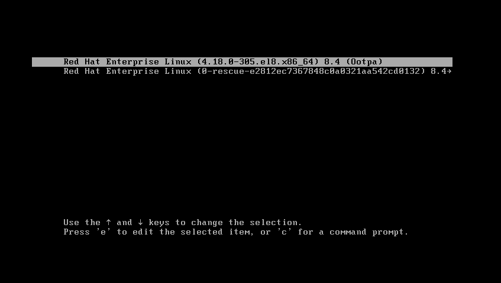

- 在 linux 行末，输入 single 或者 s 或者 1，按 `ctrl + x` 提交

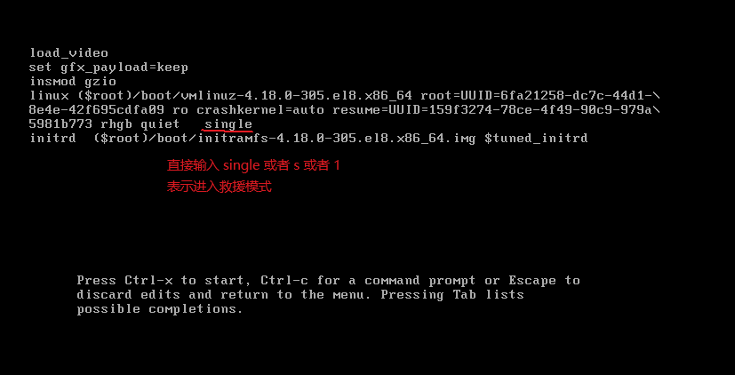

- 系统自动重启之后，进入到了救援模式，此时可以直接输入 root 密码

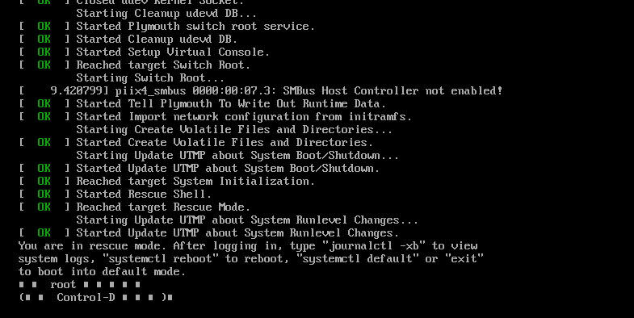

### grub 的不同模式

- rescue 救援模式：会等待 `sysinit.target` 完成，系统更多的部分会进行初始化。

- emergency 紧急模式：使 root 文件系统以只读方式挂载

这两种模式都不是正常启动，需要提供 root 密码。管理员可以利用这两个 Shell 来修复系统启动问题。

## 3. 重置 root 密码

- 通过上下键选择要修改的内核，同时按 `e` 键进入编辑模式，将光标调整到 linux 行，在结尾输入 `rd.break`，按 `ctrl + x` 提交。

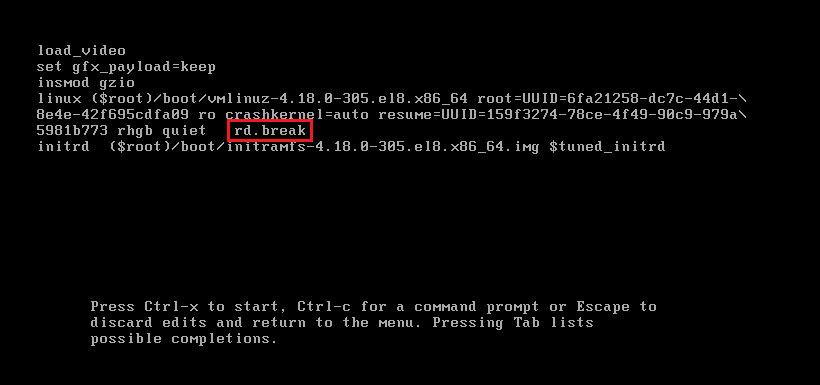

- 查看 `sysroot` 的挂载权限，此时为只读权限

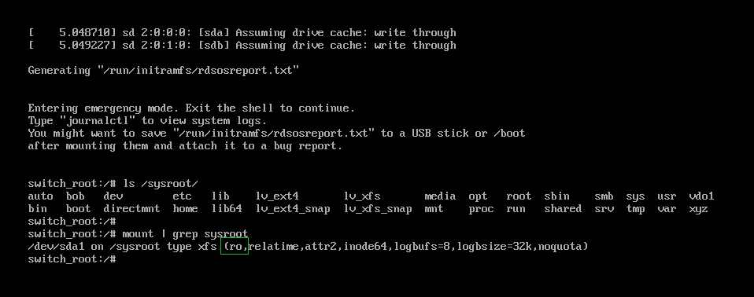

* 以读写的方式重新挂载 `/sysroot`

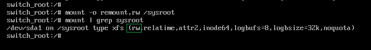

- `chroot /sysroot` 切换到 sysroot 子系统并修改密码

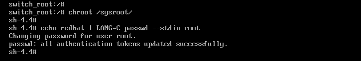

- 通过创建 `/.autorelabel` 确保所有未标记的文件在启动过程中都获得标记，用于重置系统中所有的 SELinux 上下文。按两次 exit 退出，系统会自动重启。

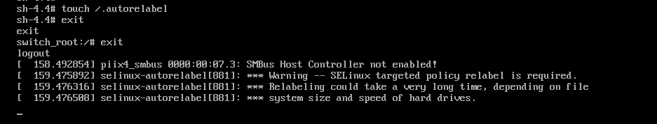

## 4. 系统修复

- 模拟系统错误，破坏硬盘上的 Bootloader 引导程序

```sh
# Bootloader 所在分区大小正好为446
dd if=/dev/zero of=/dev/sda bs=1 count=446

[root@server130 ~]# dd if=/dev/zero of=/dev/sda bs=1 count=446
记录了446+0 的读入
记录了446+0 的写出
446 bytes copied, 0.00218838 s, 204 kB/s
```

* 重启系统。此时因为在硬盘找不到引导程序，会进入到启动菜单，选择从光盘或者网络引导。这里选择 `troubleshooting`

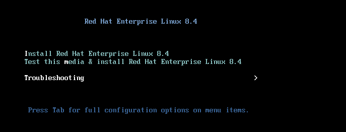

* 选择修复系统 Rescue a Red Hat Enterprise Linux System，此时相当于进入了 WinPE 模式，不需要输入密码

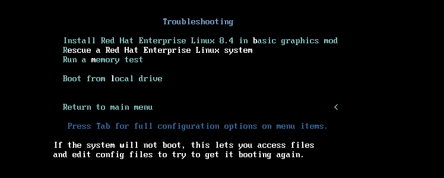

* 系统自动重启，选择 1 Continue

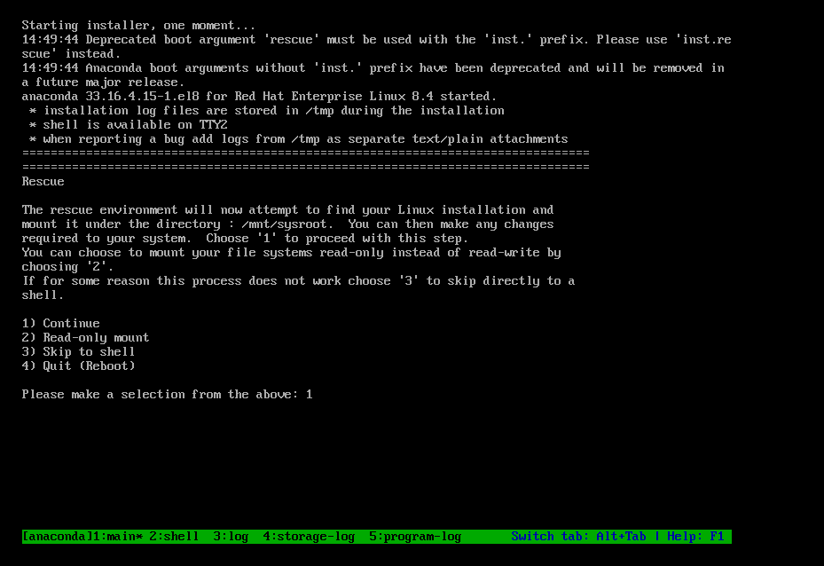

* 切换到光盘的根目录下，重装 Bootloader 引导程序，exit 退出后直接重启系统，完成修复

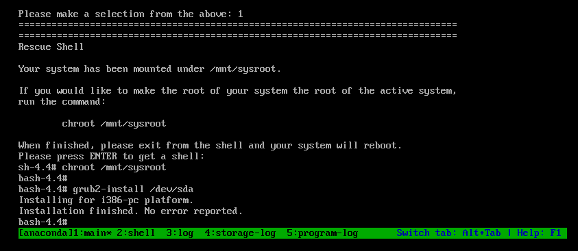
